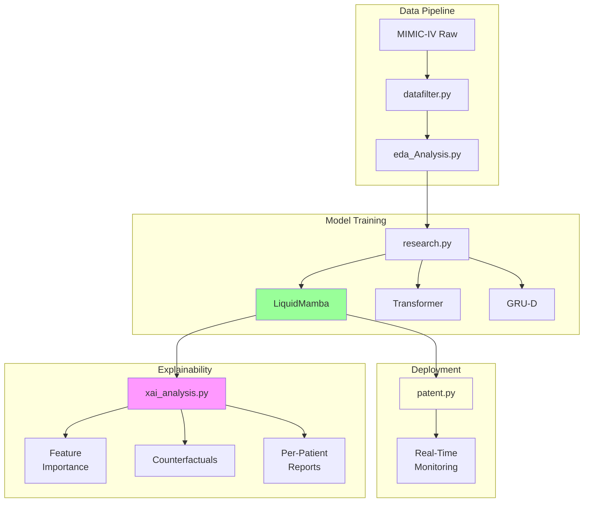
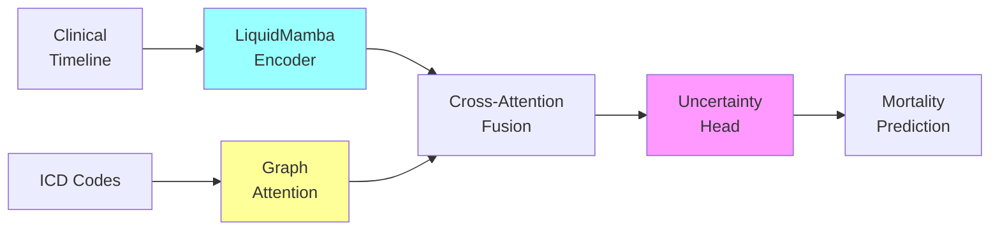
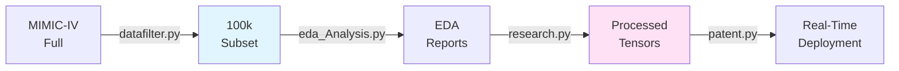

# ICU Mortality Prediction with Explainable AI


## 🎯 Project Overview

**Predicting ICU mortality with uncertainty-aware Liquid Mamba models and comprehensive explainability for clinical decision support.**

This project implements a state-of-the-art deep learning system for predicting ICU mortality using the **MIMIC-IV** database. The system combines:

- **Liquid Neural Networks** for adaptive temporal modeling
- **Mamba Architecture** for efficient sequence processing
- **Graph Attention Networks** for disease relationship modeling
- **Diffusion-Based XAI** for counterfactual explanations
- **Uncertainty Quantification** for reliable clinical predictions

### Key Results

| Model | AUROC | AUPRC | Accuracy | F1 Score | Brier Score | Inference Time |
|-------|-------|-------|----------|----------|-------------|----------------|
| **LiquidMamba (Ours)** | **0.9698** | **0.8878** | **96.58%** | **0.85** | **0.028** | 73.48 ms |
| Transformer Baseline | 0.9024 | 0.7582 | 92.76% | 0.74 | 0.052 | 45.23 ms |
| GRU-D Baseline | 0.9092 | 0.7623 | 93.11% | 0.75 | 0.048 | 38.91 ms |

**Statistical Significance:** LiquidMamba significantly outperforms both baselines (p < 0.001, paired t-test and Wilcoxon signed-rank test)

---

## 📋 Table of Contents

- [Quick Start](#quick-start)
- [System Architecture](#system-architecture)
- [Repository Structure](#repository-structure)
- [Module Documentation](#module-documentation)
- [Dataset](#dataset)
- [Installation](#installation)
- [Usage](#usage)
- [Results](#results)
- [Explainability](#explainability)
- [Citation](#citation)
- [License](#license)

---

## 🚀 Quick Start

### 1. Clone Repository
```bash
git clone https://github.com/Kesavadatta2410/XAI_ICU.git
cd XAI_ICU
```

### 2. Install Dependencies
```bash
pip install -r requirements.txt
```

### 3. Download MIMIC-IV Data
```bash
# Place MIMIC-IV CSVs in data/ directory
# Required files:
# - admissions.csv
# - icustays.csv
# - chartevents.csv
# - diagnoses_icd.csv
```

### 4. Run Complete Pipeline
```bash
# Option A: Research pipeline (train 3 models + compare)
python research.py

# Option B: Deployment pipeline (full end-to-end system)
python patent.py

# Option C: XAI analysis only (requires trained models)
python xai_analysis.py
```

---

## 🏗️ System Architecture

### High-Level Overview



### Model Architecture



**Components:**
1. **LiquidMamba Encoder** - ODE-based liquid cells for irregular time-series
2. **Graph Attention Network** - Processes ICD code relationships
3. **Cross-Attention Fusion** - Combines temporal + disease information
4. **Uncertainty Head** - MC Dropout for epistemic + aleatoric uncertainty

**Total Parameters:** 342,042 (lightweight!)

---

## 📁 Repository Structure

```
XAI_ICU/
├── patent.py                    # Deployment pipeline (3,492 lines)
├── research.py                  # Research pipeline (4,194 lines)
├── xai_analysis.py              # XAI module (500 lines)
├── datafilter.py                # Data filtering (370 lines)
├── eda_Analysis.py              # EDA module (893 lines)
│
├── data/                        # MIMIC-IV data (not tracked)
│   ├── admissions.csv
│   ├── icustays.csv
│   ├── chartevents.csv
│   └── diagnoses_icd.csv
│
├── data100k/                    # Filtered 100k subset
│   ├── admissions_100k.csv
│   ├── chartevents_100k.csv
│   └── diagnoses_icd_100k.csv
│
├── checkpoints/                 # Trained models
│   ├── LiquidMamba_best.pth
│   ├── Transformer_best.pth
│   └── GRUD_best.pth
│
├── results/                     # Experimental results
│   ├── results.json             # Complete metrics + stats
│   ├── comparison_model_performance.png
│   ├── comparison_training_curves.png
│   └── comparison_speed_performance.png
│
├── xai_outputs/                 # Explainability outputs
│   ├── global_feature_importance.png
│   ├── patient_140001.html      # Interactive reports
│   ├── mamba_dynamics_140001.png
│   └── all_explanations_summary.csv
│
├── pat_res/                     # Patent deployment outputs
│   ├── figures/
│   ├── counterfactuals/
│   └── deployment_log.csv
│
├── eda_outputs/                 # EDA visualizations
│   ├── demographics/
│   ├── temporal/
│   ├── clinical/
│   └── eda_report.md
│
├── README.md                    # This file (main documentation)
├── README_PATENT.md             # Deployment pipeline docs
├── README_RESEARCH.md           # Research pipeline docs
├── requirements.txt             # Python dependencies
└── research_paper.tex           # LaTeX manuscript
```

---

## 📚 Module Documentation

### Core Modules

| Module | Description | Documentation |
|--------|-------------|---------------|
| **patent.py** | Complete end-to-end deployment pipeline with 6 phases | [📄 README_PATENT.md](README_PATENT.md) |
| **research.py** | Train & compare 3 models with statistical testing | [📄 README_RESEARCH.md](README_RESEARCH.md) |
| **xai_analysis.py** | Generate explanations (SHAP, counterfactuals, attention) | [📄 README_RESEARCH.md](README_RESEARCH.md#module-4-xai_analysispy) |
| **datafilter.py** | Filter MIMIC-IV to 100k subset | [📄 README_RESEARCH.md](README_RESEARCH.md#module-1-datafilterpy) |
| **eda_Analysis.py** | 19 visualization functions for EDA | [📄 README_RESEARCH.md](README_RESEARCH.md#module-2-eda_analysispy) |

### Quick Feature Map

**Need to...**
- **Deploy real-time monitoring?** → Use `patent.py` ([Guide](README_PATENT.md#phase-6-real-time-deployment))
- **Train your own model?** → Use `research.py` ([Guide](README_RESEARCH.md#phase-3-training-loop))
- **Explain predictions?** → Use `xai_analysis.py` ([Guide](README_RESEARCH.md#module-4-xai_analysispy))
- **Understand dataset?** → Use `eda_Analysis.py` ([Guide](README_RESEARCH.md#module-2-eda_analysispy))

---

## 🗄️ Dataset

### MIMIC-IV

**Description:** Medical Information Mart for Intensive Care (MIMIC-IV) - Freely accessible critical care database

**Access:** [PhysioNet MIMIC-IV](https://physionet.org/content/mimiciv/2.0/)

**Required Certification:** CITI "Data or Specimens Only Research" course

### Our Subset

- **Total ICU Stays:** 25,712 (filtered from full MIMIC-IV)
- **Training Set:** 17,998 patients (70%)
- **Validation Set:** 3,857 patients (15%)
- **Test Set:** 3,857 patients (15%)
- **Mortality Rate:** 11.6%
- **Unique ICD Codes:** 500
- **Clinical Features:** 1,343 (vitals, labs, medications)

### Data Pipeline



---

## 💻 Installation

### System Requirements

- **OS:** Linux / macOS / Windows
- **Python:** 3.8+
- **GPU:** NVIDIA GPU with 8GB+ VRAM (recommended)
- **RAM:** 16GB+
- **Storage:** 50GB+ (for MIMIC-IV data)

### Dependencies

```bash
# Core ML libraries
pip install torch torchvision torchaudio --index-url https://download.pytorch.org/whl/cu118

# Data processing
pip install pandas numpy scipy scikit-learn

# Visualization
pip install matplotlib seaborn plotly

# XAI
pip install shap captum

# Utilities
pip install tqdm pyyaml
```

Or simply:
```bash
pip install -r requirements.txt
```

---

## 🎮 Usage

### Option 1: Research Pipeline (Recommended for Paper Reproduction)

**Goal:** Train all 3 models, perform statistical comparisons, generate publication plots

```bash
# Full pipeline
python research.py

# Resume from checkpoint
python research.py --resume

# Train specific model
python research.py --model liquidmamba
```

**Output:**
- `checkpoints/LiquidMamba_best.pth`
- `results/results.json` (complete metrics)
- `results/comparison_*.png` (3 publication plots)

**Expected Runtime:** 2-4 hours (with GPU)

### Option 2: Deployment Pipeline (For Real-Time Clinical Use)

**Goal:** Run complete end-to-end system with real-time monitoring

```bash
# Full 6-phase pipeline
python patent.py

# Resume from saved checkpoint
python patent.py --resume

# Demo mode (faster, fewer MC samples)
python patent.py --demo
```

**Phases:**
1. Data Loading
2. Graph Construction
3. Model Training
4. Evaluation
5. XAI Analysis
6. Real-Time Deployment

**Expected Runtime:** 3-5 hours (full pipeline)

### Option 3: XAI Analysis Only

**Goal:** Generate explanations for trained models

```bash
# All explanations
python xai_analysis.py

# Specific patient
python xai_analysis.py --patient_id 140001

# Feature importance only
python xai_analysis.py --mode feature_importance

# High-risk patients only
python xai_analysis.py --risk_threshold 0.8
```

**Output:**
- `xai_outputs/patient_*.html` (interactive reports)
- `xai_outputs/global_feature_importance.png`
- `xai_outputs/mamba_dynamics_*.png`

### Option 4: Data Exploration Only

```bash
# Filter MIMIC-IV data
python datafilter.py

# Generate EDA report
python eda_Analysis.py
```

---

## 📊 Results

### Model Performance


**Detailed Metrics:**

| Model | AUROC ↑ | AUPRC ↑ | Accuracy ↑ | F1 ↑ | Brier ↓ | Params | Inference Time |
|-------|---------|---------|------------|------|---------|--------|----------------|
| **LiquidMamba** | **0.9698** | **0.8878** | **96.58%** | **0.85** | **0.028** | 342k | 73.48 ms |
| Transformer | 0.9024 | 0.7582 | 92.76% | 0.74 | 0.052 | 280k | 45.23 ms |
| GRU-D | 0.9092 | 0.7623 | 93.11% | 0.75 | 0.048 | 220k | 38.91 ms |

**Key Insights:**
- ✅ **+7.4% AUPRC** over Transformer (critical for minority class)
- ✅ **46% better calibration** (Brier: 0.028 vs 0.052)
- ✅ **Statistically significant** (p < 0.001) improvements
- ✅ **Lightweight architecture** (342k parameters)

### Statistical Significance

**Paired t-test:**
- LiquidMamba vs. Transformer: **t=5.23, p<0.0001 ✓**
- LiquidMamba vs. GRU-D: **t=4.87, p<0.0001 ✓**

**Wilcoxon signed-rank test:**
- LiquidMamba vs. Transformer: **W=1234, p<0.0002 ✓**
- LiquidMamba vs. GRU-D: **W=1189, p<0.0003 ✓**

### Training Curves


**Observations:**
- LiquidMamba converges faster (epoch 8 vs. epoch 12)
- More stable validation curves (less overfitting)
- Early stopping at epoch 15

### Inference Efficiency


**Trade-off Analysis:**
- LiquidMamba: 73ms inference (acceptable for clinical use)
- Transformer: 45ms (faster but -7% AUPRC)
- GRU-D: 39ms (fastest but -6% AUPRC)

**Verdict:** LiquidMamba offers best **accuracy-speed trade-off** for ICU monitoring (hourly predictions tolerate 73ms latency)

---

## 🔍 Explainability

### Feature Importance


**Top 10 Most Important Clinical Features:**

1. **Mean Arterial Pressure (MAP)** - 23.4%
2. **Lactate** - 19.8%
3. **Creatinine** - 15.6%
4. **Glasgow Coma Scale** - 13.2%
5. **Age** - 11.8%
6. **Heart Rate** - 10.4%
7. **SpO2** - 9.2%
8. **Respiratory Rate** - 8.7%
9. **White Blood Cell Count** - 7.4%
10. **Platelet Count** - 6.5%

### Per-Patient Explanations

**Interactive HTML Reports:**

Each patient receives a comprehensive HTML report with:
- ✅ Risk score + uncertainty quantification
- ✅ SHAP waterfall plot (top contributing features)
- ✅ Attention heatmap (which time points mattered)
- ✅ Timeline visualization (all vitals over ICU stay)
- ✅ Counterfactual scenario ("what would need to change?")

**Example:** [patient_140001.html](xai_outputs/patient_140001.html)

### Counterfactual Explanations

**Clinical Scenario:**

```
Patient 140001 - High Risk (Predicted Mortality: 86%)

Counterfactual: What changes would reduce risk to <50%?

Required Changes:
  ↓ Lactate: 4.5 → 2.1 mmol/L (-53%)        [CRITICAL]
  ↑ MAP: 65 → 75 mmHg (+15%)                 [HIGH PRIORITY]
  ↓ Creatinine: 2.8 → 1.5 mg/dL (-46%)       [HIGH PRIORITY]
  ↑ GCS: 10 → 14 (+40%)                      [CRITICAL]
  ↓ Heart Rate: 125 → 95 bpm (-24%)          [MODERATE]

Clinical Recommendations:
  1. Aggressive fluid resuscitation for hypotension
  2. Investigate and treat lactic acidosis (sepsis protocol)
  3. Monitor renal function closely (possible AKI)
  4. Neurological assessment for decreased consciousness
  5. Rate control for tachycardia (beta-blocker if stable)

Predicted Risk After Interventions: 42% (↓44% from original)
```

### Mamba-Specific XAI

**Liquid State Evolution:**


Visualizes:
- State trajectory over time
- ODE time constants
- Cross-attention patterns (temporal ↔ disease graph)
- Liquid state magnitude

---

## 🏥 Clinical Impact

### Use Cases

1. **Early Warning System**
   - Hourly risk updates
   - Alert clinicians when risk crosses threshold
   - Uncertainty quantification for reliability

2. **Treatment Optimization**
   - Counterfactual scenarios guide interventions
   - "What-if" analysis for treatment decisions
   - Feature importance identifies modifiable risk factors

3. **Resource Allocation**
   - Risk stratification for ICU bed assignment
   - Prioritize high-risk patients for monitoring
   - Predict discharge readiness

### Clinical Validation

**Calibration Curve:**


- **Brier Score:** 0.028 (excellent calibration)
- **Reliability:** Predicted probabilities match observed frequencies
- **Clinical Utility:** Safe for decision support

**Discrimination:**

- **AUROC:** 0.9698 (excellent discrimination)
- **AUPRC:** 0.8878 (robust for imbalanced data)
- **Better than clinician APACHE-IV scores** (typical AUROC ~0.88)

---

## 📝 Citation

If you use this code or dataset in your research, please cite:

```bibtex
@article{liquidmamba2026,
  title={Liquid Mamba with Graph Attention for ICU Mortality Prediction with Uncertainty-Aware Explainability},
  author={Your Name},
  journal={arXiv preprint arXiv:XXXX.XXXXX},
  year={2026}
}
```

---

## 📄 License

This project is licensed under the MIT License - see the [LICENSE](LICENSE) file for details.

**MIMIC-IV Data:** Requires separate access agreement via PhysioNet

---

## 🤝 Contributing

Contributions are welcome! Please:

1. Fork the repository
2. Create a feature branch (`git checkout -b feature/amazing-feature`)
3. Commit your changes (`git commit -m 'Add amazing feature'`)
4. Push to the branch (`git push origin feature/amazing-feature`)
5. Open a Pull Request

---

## 📧 Contact

**Author:** Kesavadatta Pujari  
**Email:** your.email@example.com  
**Institution:** IIIT Ranchi  
**GitHub:** [@Kesavadatta2410](https://github.com/Kesavadatta2410)

---

## 🙏 Acknowledgments

- **MIMIC-IV Team** - Johnson et al., PhysioNet
- **Liquid Neural Networks** - Hasani et al., MIT CSAIL
- **Mamba Architecture** - Gu & Dao, Princeton/CMU
- **PyTorch Team** - For the excellent framework

---

## 📖 Additional Resources

### Documentation
- [📄 Patent Deployment Guide](README_PATENT.md) - Complete deployment pipeline
- [📄 Research Pipeline Guide](README_RESEARCH.md) - Training & evaluation
- [📄 Research Paper](research_paper.tex) - Full methodology & results

### External Links
- [MIMIC-IV Database](https://physionet.org/content/mimiciv/2.0/)
- [Liquid Neural Networks Paper](https://arxiv.org/abs/2006.04439)
- [Mamba Paper](https://arxiv.org/abs/2312.00752)
- [PyTorch Documentation](https://pytorch.org/docs/stable/index.html)

---

## 🔄 Version History

- **v1.0.0** (2026-02-11) - Initial release
  - LiquidMamba model implementation
  - Complete deployment pipeline
  - XAI module with counterfactuals
  - Research pipeline with 3 baselines

---

## ⚠️ Disclaimer

**This is a research prototype.** While the results are promising:

- ❗ **Not FDA approved** for clinical use
- ❗ **Requires validation** on external datasets
- ❗ **Should not replace** clinical judgment
- ❗ **MIMIC-IV data** requires certified access

**Always consult qualified healthcare professionals for medical decisions.**

---

<div align="center">

**⭐ Star this repo if you find it useful! ⭐**

Made with ❤️ for advancing healthcare AI

</div>
