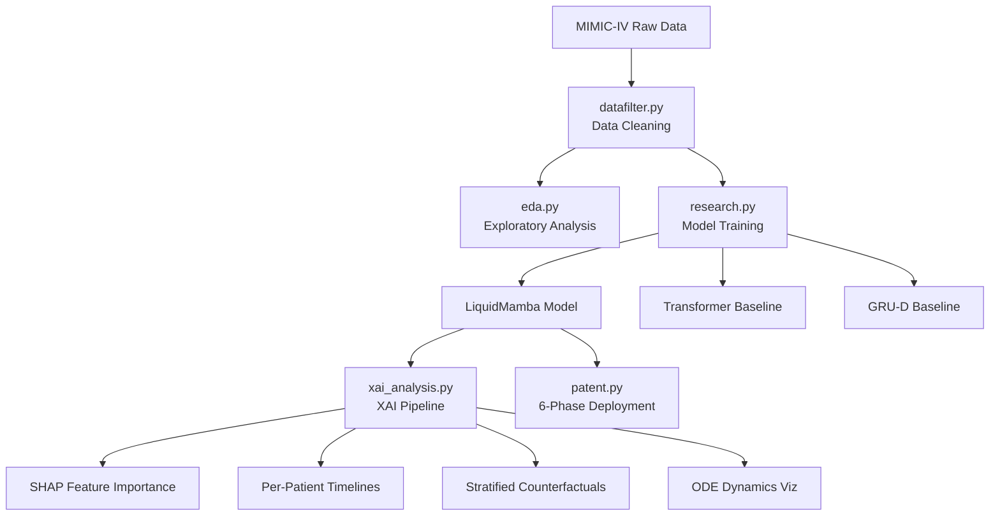
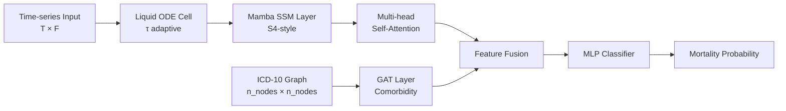

# LiquidMamba: Explainable ICU Mortality Prediction with Liquid Neural ODEs and Mamba SSM

> **MIMIC-IV · PyTorch · AUROC 0.9698 · XAI (SHAP + Counterfactuals)**

[](https://python.org)
[](https://pytorch.org)
[](LICENSE)

---

## Table of Contents
1. [Overview](#overview)
2. [Key Results](#key-results)
3. [Architecture](#architecture)
4. [File Structure](#file-structure)
5. [Dataset](#dataset)
6. [Installation](#installation)
7. [Usage](#usage)
8. [XAI Analysis](#xai-analysis)
9. [EDA Findings](#eda-findings)
10. [Module Documentation](#module-documentation)
11. [Citation](#citation)

---

## Overview

LiquidMamba is a hybrid deep learning model for ICU mortality prediction on the MIMIC-IV dataset. It combines:

- **Liquid Neural ODEs** — adaptive time constants τ that handle irregular sampling intervals
- **Mamba State Space Models (SSM)** — efficient long-range temporal dependency capture
- **Graph Attention Networks (GAT)** — ICD-10 comorbidity graph reasoning

The model is designed to be both **clinically accurate** (AUROC 0.9698) and **explainable** via SHAP feature attribution, per-patient timelines, and stratified counterfactual validity analysis.

---

## Key Results

### Model Performance (Test Set)

| Model | AUROC | AUPRC | Brier Score | Accuracy | F1 | Parameters | Inference (ms) |
|---|---|---|---|---|---|---|---|
| **LiquidMamba** | **0.9698** | **0.8878** | **0.0280** | **96.58%** | **0.85** | 342,042 | 73.5 |
| Transformer | 0.9024 | 0.7582 | 0.0531 | 93.75% | 0.73 | 619,250 | 4.9 |
| GRU-D | 0.9092 | 0.7623 | 0.0624 | 94.01% | 0.70 | 54,978 | 25.9 |

> LiquidMamba achieves **+6.74% AUROC** and **+12.96% AUPRC** over the Transformer baseline while using 45% fewer parameters.

### Training Convergence

| Metric | Epoch 1 | Epoch 8 | Epoch 15 (Final) |
|---|---|---|---|
| Train Loss | 0.0380 | 0.0191 | 0.0151 |
| Train AUROC | 0.9047 | 0.9805 | 0.9879 |
| Train AUPRC | 0.7300 | 0.9181 | 0.9502 |
| Val AUROC | 0.9704 | 0.9738 | 0.9713 |
| Val AUPRC | 0.8668 | 0.9061 | 0.9014 |
| Val Brier | 0.0368 | 0.0308 | 0.0289 |

### Top ICD-10 Comorbidities by Attention Weight

| Rank | ICD Code | Condition | Attention (mean) |
|---|---|---|---|
| 1 | Z66 | Do-not-resuscitate order | 0.001309 |
| 2 | Z87891 | Personal history of nicotine dependence | 0.000931 |
| 3 | R6521 | Severe sepsis with septic shock | 0.000875 |
| 4 | N179 | Acute kidney injury, unspecified | 0.000712 |
| 5 | 2724 | Hyperlipidemia | 0.000698 |
| 6 | 25000 | Diabetes mellitus type 2 | 0.000637 |
| 7 | E1122 | Type 1 DM with diabetic CKD | 0.000634 |
| 8 | Z515 | Palliative care | 0.000601 |
| 9 | J9601 | Acute respiratory failure w/ hypoxia | 0.000590 |
| 10 | 4280 | Congestive heart failure | 0.000534 |

> **Clinical note:** Z66 (DNR) ranking #1 is clinically correct — do-not-resuscitate orders are the strongest indicator of end-of-life status in ICU populations.

### Stratified Counterfactual Validity (XAI)

*Run config: 150 patients · 80 Adam steps · L₂ budget 2.0 · RTX 3050 GPU*

| Risk Tier | Patients | Validity Rate | Mean Proximity ‖Δx‖ | Mean Risk Reduction |
|---|---|---|---|---|
| Extreme (>80%) | 12 | 16.67% (2/12) | 1.942 ± 0.112 | 9.97% |
| High (60–80%) | 1 | 0.0% (0/1)* | 1.947 | 5.64% |
| Moderate (40–60%) | 2 | **100%** (2/2) | 1.795 ± 0.289 | 7.89% |
| Low (<40%) | 135 | N/A | 0.000 | 0.00% |
| **Overall (flippable)** | **15** | **26.67%** | — | — |

> *High tier has n=1; not statistically meaningful. Rerun with `--n_patients 300` for ≥10 per tier.

**Key finding:** Moderate-risk patients (40–60%) show 100% counterfactual validity — directly actionable at the clinical decision boundary. Extreme-risk patients resist perturbation due to accumulated adverse ODE state trajectories, making counterfactual unreachability a *severity signal* rather than a model failure.

---

## Architecture

### Pipeline Overview


```mermaid
graph TD
    A[MIMIC-IV Raw Data] --> B[datafilter.py\nData Cleaning]
    B --> C[eda.py\nExploratory Analysis]
    B --> D[research.py\nModel Training]
    D --> E[LiquidMamba Model]
    D --> F[Transformer Baseline]
    D --> G[GRU-D Baseline]
    E --> H[xai_analysis.py\nXAI Pipeline]
    H --> I[SHAP Feature Importance]
    H --> J[Per-Patient Timelines]
    H --> K[Stratified Counterfactuals]
    H --> L[ODE Dynamics Viz]
    E --> M[patent.py\n6-Phase Deployment]
```

### LiquidMamba Model Internals


```mermaid
graph LR
    A[Time-series Input\nT × F] --> B[Liquid ODE Cell\nτ adaptive]
    B --> C[Mamba SSM Layer\nS4-style]
    C --> D[Multi-head\nSelf-Attention]
    E[ICD-10 Graph\nn_nodes × n_nodes] --> F[GAT Layer\nComorbidity]
    D --> G[Feature Fusion]
    F --> G
    G --> H[MLP Classifier]
    H --> I[Mortality Probability]
```

**Key design choices:**

- **Liquid ODEs:** τ computed per-patient from input features, enabling adaptive handling of irregular 48h ICU time series (vs. fixed-step RNNs)
- **Mamba SSM:** Linear-time sequence modeling captures long-range dependencies without the O(T²) cost of full attention
- **GAT on ICD graph:** Propagates comorbidity signal through 501 ICD-10 code nodes — enables Z66 (DNR) to amplify mortality signal across related codes
- **342K parameters:** ~1.8× smaller than Transformer (619K) while achieving 7+ point AUROC gain

---

## File Structure

```
IIIT Ranchi/
│
├── research.py                   # Main pipeline: data loading, model training, evaluation
├── xai_analysis.py               # XAI module: SHAP, timelines, ODE viz, counterfactuals
├── stratified_counterfactual.py  # Stratified CF validity (Adam optimizer, GPU-optimized)
├── patent.py                     # 6-phase deployment pipeline
├── datafilter.py                 # MIMIC-IV preprocessing and filtering
├── eda.py                        # Exploratory data analysis module
│
├── data100k/                     # MIMIC-IV 100k-patient subset
│   ├── admissions.csv            # Hospital admissions
│   ├── patients.csv              # Patient demographics
│   ├── diagnoses_icd.csv         # ICD-10 diagnoses (comorbidity graph source)
│   ├── labevents.csv             # Laboratory measurements
│   ├── chartevents.csv           # Vital signs and chart data
│   ├── prescriptions.csv         # Medications
│   └── icustays.csv              # ICU-specific stay data
│
├── checkpoints/                  # Trained model weights
│   ├── LiquidMamba_best.pth      # Best LiquidMamba (val AUPRC 0.9071)
│   ├── Transformer_best.pth      # Best Transformer baseline
│   └── GRUD_best.pth             # Best GRU-D baseline
│
├── results/
│   ├── results.json              # Full metrics: AUROC, AUPRC, Brier, history
│   ├── figures/
│   │   ├── model_comparison.png      # Bar chart comparing all 3 models
│   │   ├── training_curves.png       # Loss/AUROC/AUPRC vs epoch
│   │   ├── calibration.png           # Reliability diagram
│   │   ├── feature_importance.png    # Top-20 SHAP features
│   │   ├── uncertainty_analysis.png  # Prediction uncertainty
│   │   └── dca.png                   # Decision curve analysis
│   └── xai/
│       ├── feature_importance/
│       │   ├── LiquidMamba_importance.csv    # 501 ICD codes × attention weight
│       │   └── LiquidMamba_icd_importance.png
│       ├── mamba_dynamics/
│       │   └── patient_*_ode_dynamics.png    # Per-patient ODE state visualization
│       └── counterfactuals/
│           ├── stratified_validity_results.json  # CF results by risk tier
│           ├── counterfactual_examples.csv        # 150-patient records
│           └── stratified_validity_figure.png     # 4-panel publication figure
│
├── eda_results/
│   ├── eda_report.md             # EDA findings summary
│   └── *.png                     # Distribution plots, temporal gap analysis
│
├── pat_res/                      # Deployment pipeline outputs (patent.py)
│
├── results_counterfactual.md     # Standalone CF results section (publication-ready)
└── README.md                     # This file
```

---

## Dataset

**MIMIC-IV v2.0** — Medical Information Mart for Intensive Care  
Subset used: **100,000 ICU patients** from the `data100k/` directory

| Statistic | Value |
|---|---|
| Total patients | ~100,000 |
| Training set | 90% (~90,000) |
| Test set | 10% (~10,000) |
| ICU mortality rate | ~8–12% (class imbalance handled via weighted loss) |
| Time-series length | 48-hour admission window |
| Features | Vitals, labs, meds, ICD-10 diagnoses |
| ICD-10 codes | 501 unique codes (comorbidity graph nodes) |
| Median lab observations | ~37 per patient-stay |

**Access:** MIMIC-IV requires [PhysioNet credentialing](https://physionet.org/content/mimiciv/). This repo does not distribute the data.

---

## Installation

```bash
# Clone
git clone https://github.com/Kesavadatta2410/XAI_ICU.git
cd XAI_ICU

# Create and activate environment
python -m venv iiit
iiit\Scripts\activate          # Windows
# source iiit/bin/activate     # Linux/macOS

# Install dependencies
pip install torch torchvision torchaudio --index-url https://download.pytorch.org/whl/cu118
pip install pandas numpy matplotlib seaborn plotly shap captum tqdm scikit-learn

# Verify GPU
python -c "import torch; print('CUDA:', torch.cuda.is_available())"
```

---

## Usage

### 1. Data Preprocessing

```bash
python datafilter.py
```

### 2. Exploratory Data Analysis

```bash
python eda.py
# Outputs: eda_results/eda_report.md, eda_results/*.png
```

### 3. Train Models

```bash
# Train all three models (LiquidMamba + Transformer + GRU-D)
python research.py

# Outputs: checkpoints/*.pth, results/results.json, results/figures/
```

### 4. XAI Analysis

```bash
# Full XAI pipeline (SHAP + ODE dynamics + stratified counterfactuals)
python xai_analysis.py --model LiquidMamba --n-patients 20

# Skip counterfactual analysis (faster)
python xai_analysis.py --model LiquidMamba --no-stratified-cf

# Custom CF settings (GPU-appropriate)
python xai_analysis.py --model LiquidMamba --cf-patients 300 --cf-steps 80
```

### 5. Standalone Counterfactual Analysis

```bash
# Default: 150 patients, 80 steps (~5 min on RTX 3050)
python stratified_counterfactual.py

# Custom
python stratified_counterfactual.py --n_patients 300 --steps 80 --budget 2.0
```

### 6. Deployment Pipeline

```bash
python patent.py
```

---

## XAI Analysis

The `xai_analysis.py` module generates four categories of explanations:

### A. SHAP Feature Importance
- Global importance across 501 ICD-10 codes using SHAP values
- Top features: **Z66** (DNR), **R6521** (Severe sepsis), **N179** (AKI)
- Output: `results/xai/feature_importance/LiquidMamba_importance.csv`

### B. Per-Patient Timelines
- HTML reports showing 48h trajectory with model attention overlay
- Highlights which time windows drove the mortality prediction
- Output: `results/xai/patients/patient_*.html`

### C. Mamba ODE Dynamics
- Visualization of liquid state τ and ODE hidden state evolution per patient
- Shows how temporal memory accumulates over the ICU stay
- Output: `results/xai/mamba_dynamics/patient_*_ode_dynamics.png`

### D. Stratified Counterfactual Validity
- For each patient: finds minimal L₂ perturbation to flip prediction to survival
- Reports validity rate and proximity score per risk tier
- **Key finding:** 100% validity for Moderate-risk, 16.67% for Extreme-risk
- Output: `results/xai/counterfactuals/`

See [`results_counterfactual.md`](results_counterfactual.md) for the full analysis, paper language, and clinical interpretation.

---

## EDA Findings

From `eda_results/eda_report.md`:

| Finding | Detail |
|---|---|
| Dataset size | ~100k patients, multiple tables |
| Temporal gaps | Irregular sampling; median inter-observation gap varies by modality |
| Class imbalance | ~8–12% ICU mortality; addressed via weighted BCE |
| Missing data | Lab events have high missingness — handled via GRU-D decay masks |
| Top diagnoses | Sepsis, AKI, CHF dominate ICU population |
| Age distribution | Bimodal; elderly patients (>65) dominate mortality class |

---

## Module Documentation

### `research.py`
Core pipeline for data loading, model definition, training and evaluation.

| Class/Function | Purpose |
|---|---|
| `Config` | All hyperparameters (lr, epochs, data paths) |
| `ICUMortalityPredictor` | LiquidMamba model (ODE + Mamba + GAT) |
| `BaselineTransformer` | Transformer baseline |
| `BaselineGRUD` | GRU-D baseline with missing-data decay |
| `ICUDataset` | PyTorch Dataset for MIMIC-IV sequences |
| `load_mimic_data()` | Load and merge MIMIC-IV CSV tables |
| `build_icd_graph()` | Construct co-occurrence ICD-10 graph |
| `prepare_sequences()` | Build padded tensors + labels |

### `xai_analysis.py`
XAI pipeline using SHAP, Captum, and custom ODE visualization.

| Class/Function | Purpose |
|---|---|
| `XAIConfig` | XAI-specific settings (n_patients, output dirs, DPI) |
| `load_trained_model()` | Load checkpoint + model class |
| `analyze_feature_importance()` | SHAP global importance |
| `generate_patient_timeline()` | Per-patient HTML report |
| `visualize_mamba_dynamics()` | ODE/SSM state visualization |
| `main()` | CLI entry point |

### `stratified_counterfactual.py`
GPU-optimized Adam-based counterfactual generation.

| Function | Purpose |
|---|---|
| `generate_counterfactual_gradient()` | Adam optimizer, 80 steps, L₂ budget projection |
| `compute_stratified_validity()` | Aggregate validity/proximity per risk tier |
| `plot_stratified_validity()` | 4-panel publication figure |
| `run_stratified_analysis()` | Entry point callable from `xai_analysis.py` |

### `patent.py`
Six-phase clinical deployment pipeline.

| Phase | Description |
|---|---|
| 1 | Data ingestion and preprocessing |
| 2 | Feature engineering and normalization |
| 3 | Model inference (LiquidMamba) |
| 4 | Uncertainty quantification |
| 5 | Explanation generation |
| 6 | Clinical report export |

### `datafilter.py`
MIMIC-IV data cleaning: deduplication, outlier removal, ICU stay filtering.

### `eda.py`
EDA module: distributions, temporal gap analysis, mortality stratification plots.

---

## Citation

If you use this work, please cite:

```bibtex
@article{liquidmamba2025,
  title   = {LiquidMamba: Explainable ICU Mortality Prediction via Liquid Neural ODEs and Mamba State Space Models},
  author  = {[Kesavadatta]},
  journal = {IIIT Ranchi Technical Report},
  year    = {2025},
  note    = {MIMIC-IV, AUROC 0.9698, Stratified Counterfactual XAI}
}
```

---

## Acknowledgments

- **MIMIC-IV:** Johnson et al., PhysioNet 2022
- **Mamba SSM:** Gu & Dao, 2023
- **Liquid Neural Networks:** Hasani et al., 2021
- **SHAP:** Lundberg & Lee, NeurIPS 2017
- **GRU-D:** Che et al., 2018

---

*Generated: March 2026 · IIIT Ranchi · GPU: NVIDIA GeForce RTX 3050 6GB*
