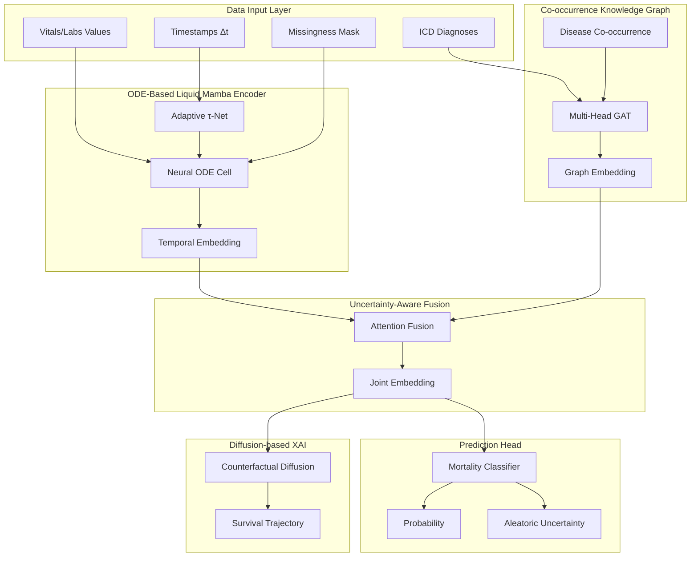

# ICU Mortality Prediction - Technical Architecture

## System Overview



---

## Component Details

### 1. ODE-Based Liquid Mamba Cell

**Mathematical Formulation:**
```
dh/dt = (1/τ(Δt)) × (f(x,h) - h)

Where:
- h: Hidden state
- τ(Δt): Adaptive time constant
- f(x,h) = tanh(Wx·x + Wh·h)
```

**Discretization (Euler):**
```
h_{t+1} = h_t + Δt × dh/dt
```

**Key Properties:**
- Small Δt → Large τ → Slow dynamics (frequent vitals)
- Large Δt → Small τ → Fast adaptation (sparse labs)

---

### 2. Co-occurrence Knowledge Graph

**Edge Weights:**
```
A[i,j] = α × Hierarchy(i,j) + β × CoOccurrence(i,j)

Where:
- Hierarchy: ICD prefix similarity (0.5/k for k-char match)
- CoOccurrence: Normalized frequency of disease pairs
```

**Multi-Head GAT:**
- 4 attention heads
- Adjacency-masked softmax
- Patient-specific node activation

---

### 3. Uncertainty-Aware Prediction Head

**Aleatoric Uncertainty:**
```
μ = Linear(embedding)
log_σ² = Linear(embedding)
σ = softplus(log_σ²)

Prediction = sigmoid(μ)
Uncertainty = σ
```

---

### 4. Counterfactual Diffusion XAI

**Forward Process:**
```
x_t = √(ᾱ_t) × x_0 + √(1-ᾱ_t) × ε
```

**Reverse (Denoising):**
```
x_{t-1} = (1/√α_t) × (x_t - (1-α_t)/√(1-ᾱ_t) × ε_θ(x_t, t, c))
```

**Conditioning:** Target survival label + patient embedding

---

## File Structure

```
research.py
├── Config                    # Hyperparameters
├── ICUDataProcessor          # Data loading & normalization
├── ICDHierarchicalGraph      # Knowledge graph with co-occurrence
├── GraphAttentionNetwork     # Multi-head GAT
├── ODELiquidCell             # Neural ODE temporal cell
├── LiquidMambaEncoder        # Full temporal encoder
├── UncertaintyMortalityHead  # Calibrated predictions
├── CounterfactualDiffusion   # XAI generator
├── ICUMortalityPredictor     # Full model
├── train_epoch / evaluate    # Training loop
├── plot_* functions          # Visualizations
└── main()                    # Entry point
```

---

## Output Artifacts

| File | Description |
|------|-------------|
| `training_curves.png` | Loss, AUROC, AUPRC over epochs |
| `calibration.png` | Reliability diagram |
| `uncertainty_analysis.png` | Uncertainty distribution |
| `dca.png` | Decision Curve Analysis |
| `metrics.json` | All numerical results |
| `best_model.pt` | Trained model weights |
