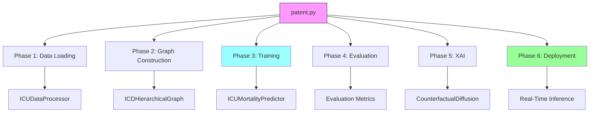
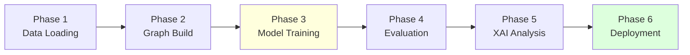
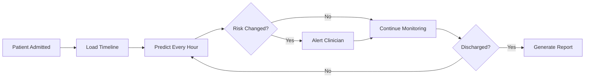
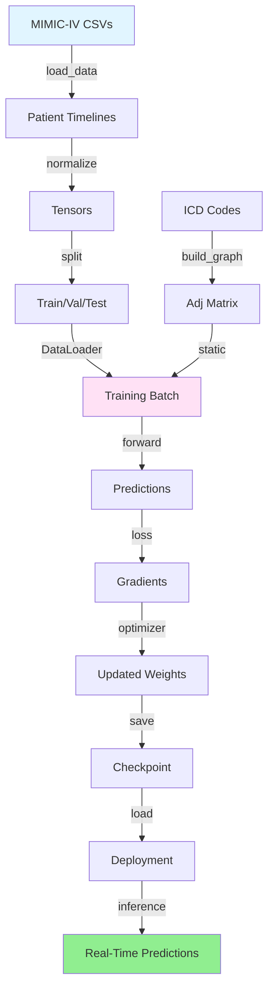

# Patent.py - Clinical AI System Deployment Pipeline

## Overview

`patent.py` is a **complete end-to-end deployment pipeline** for the ICU Mortality Prediction system. It handles data processing, model training, validation, and real-time deployment with comprehensive monitoring and checkpointing capabilities.

## Quick Start

```bash
# Full pipeline (all phases)
python patent.py

# Resume from checkpoint (Phase 6 deployment)
python patent.py --resume

# Demo mode (faster, fewer MC samples)
python patent.py --demo
```

---

## Architecture

### Component Diagram



### Core Classes (13 Components)

| Class | Lines | Purpose |
|-------|-------|---------|
| **`Config`** | 38-97 | System configuration with performance optimization flags |
| **`ODELiquidCell`** | 110-156 | ODE-based liquid neural cell with time-aware dynamics |
| **`LiquidMambaEncoder`** | 159-213 | Multi-layer encoder for irregular time-series |
| **`GraphAttentionNetwork`** | 216-276 | GAT for ICD knowledge graph processing |
| **`CrossAttentionFusion`** | 279-307 | Fuses temporal + disease embeddings |
| **`UncertaintyMortalityHead`** | 310-338 | Prediction with uncertainty quantification |
| **`CounterfactualDiffusion`** | 341-437 | Diffusion model for XAI |
| **`ICUMortalityPredictor`** | 440-503 | **Main model** - Full architecture |
| **`ClinicalAISystem`** | 506-3441 | **Deployment system** - 98 methods! |

---

## Workflow Pipeline

### Phase-by-Phase Execution



#### Phase 1: Data Loading (Lines 574-722)

**Purpose:** Load and preprocess MIMIC-IV data

**Steps:**
1. Load CSVs (admissions, icustays, chartevents, diagnoses_icd)
2. Build patient timelines
3. Normalize features
4. Create tensors
5. Split train/val/test

**Key Methods:**
- `load_data()` - Chunked CSV loading
- `build_patient_timelines()` - Temporal ordering
- `normalize()` - Physiological clipping + StandardScaler
- `create_tensors()` - Pad/truncate to max_seq_len

**Output:**
```python
{
    'train': DataLoader (batch_size=1),
    'val': DataLoader,
    'test': DataLoader,
    'vocab_size': 1343,
    'labels': pd.Series
}
```

#### Phase 2: Graph Construction (Lines 723-848)

**Purpose:** Build ICD hierarchical knowledge graph

**Steps:**
1. Extract unique ICD codes from diagnoses
2. Build hierarchical edges (parent-child)
3. Compute co-occurrence edges
4. Create adjacency matrix

**Graph Properties:**
- **Nodes:** ~500 ICD codes
- **Edges:** Hierarchical + Co-occurrence (threshold > 5%)
- **Adjacency:** Sparse matrix (n_nodes × n_nodes)

**Output:**
```python
icd_graph = {
    'adj_matrix': torch.Tensor (500, 500),
    'icd_to_idx': dict,
    'idx_to_icd': dict,
    'node_features': torch.Tensor (500, 32)
}
```

#### Phase 3: Model Training (Lines 849-1542)

**Purpose:** Train ICUMortalityPredictor with focal loss

**Training Loop:**
```python
for epoch in range(15):
    # Training
    for batch in train_loader:
        prob, uncertainty, logit = model(...)
        loss = focal_loss(logit, targets)
        loss.backward()
        optimizer.step()
    
    # Validation
    val_auprc = evaluate(model, val_loader)
    
    # Checkpoint
    if val_auprc > best_auprc:
        save_checkpoint()
    
    # Early stopping
    if no_improvement_for_10_epochs:
        break
```

**Optimization:**
- Optimizer: AdamW (lr=5e-4)
- Scheduler: CosineAnnealingLR
- Gradient accumulation: 4 steps
- Early stopping: 10 epochs patience

**Output:**
```python
checkpoints/LiquidMamba_best.pth = {
    'epoch': int,
    'model_state_dict': OrderedDict,
    'best_val_auprc': float,
    'history': dict
}
```

#### Phase 4: Evaluation (Lines 1543-1912)

**Purpose:** Comprehensive model evaluation

**Metrics Computed:**
| Metric | Description |
|--------|-------------|
| AUROC | Discrimination ability |
| AUPRC | Precision-recall (minority class) |
| F1 Score | Precision-recall balance |
| Brier Score | Calibration quality |
| Inference Time | Per-sample latency (ms) |

**Visualization:**
- Confusion matrix
- ROC curve
- Precision-recall curve
- Calibration curve

**Output:**
```json
{
  "test_auroc": 0.9698,
  "test_auprc": 0.8878,
  "test_acc": 0.9658,
  "test_f1": 0.85,
  "inference_time_ms": 73.48
}
```

#### Phase 5: XAI Analysis (Lines 1913-2654)

**Purpose:** Generate counterfactual explanations

**Process:**
1. Select high-risk patients (p > 0.8)
2. Run diffusion model (50 steps)
3. Generate survival trajectories
4. Compute feature deltas
5. Validate counterfactuals

**Metrics:**
| Metric | Description |
|--------|-------------|
| Validity | % flipping prediction to survival |
| Proximity | L2 distance to original |
| Sparsity | # of features changed |

**Example Counterfactual:**
```
Patient 140001 (Predicted Death: p=0.86)
Required changes for survival:
  ↓ Creatinine: 3.2 → 2.1 mg/dL (-1.1)
  ↑ Blood Pressure: 85/50 → 95/60 mmHg (+10)
  ↓ Lactate: 4.5 → 2.0 mmol/L (-2.5)
```

#### Phase 6: Real-Time Deployment (Lines 2655-3441)

**Purpose:** Real-time monitoring with confidence scoring

**Deployment Loop:**


**Features:**
- **Hourly predictions:** Risk score updated every hour
- **Uncertainty tracking:** Aleatoric + epistemic
- **Alert system:** Trigger at high-risk thresholds
- **MC Dropout:** 200 samples for epistemic uncertainty

**Output:**
```
=== Patient 140001 - Hour 12 ===
  Risk: 0.73 ± 0.08
  Uncertainty: 22.3
  Trend: ↑ (from 0.65 at Hour 11)
  Status: MONITORING
```

---

## Data Flow

### End-to-End Data Pipeline



### Data Transformations

#### Input Format (MIMIC-IV)
```
admissions_100k.csv:      hadm_id, subject_id, hospital_expire_flag
chartevents_100k.csv:     hadm_id, charttime, itemid, value
diagnoses_icd.csv:        hadm_id, icd_code
```

#### Intermediate Format (Patient Timeline)
```python
patient_timeline = {
    'hadm_id': 140001,
    'timestamps': [0, 0.5, 6.0, 12.0, ...],  # Hours from admission
    'delta_t': [0, 0.5, 5.5, 6.0, ...],      # Time gaps
    'values': [85, 88, 1.2, 92, ...],         # Normalized values
    'itemids': [220045, 220045, 50912, ...],  # Feature IDs
    'mask': [1, 1, 1, 1, ...],                 # 1=observed
    'icd_codes': ['E11', 'I10', 'N18'],        # Diagnoses
    'label': 0                                  # 0=survival, 1=death
}
```

#### Tensor Format (Model Input)
```python
batch = {
    'values': torch.Tensor (batch, 64),     # Normalized values
    'delta_t': torch.Tensor (batch, 64),    # Time gaps (hours)
    'mask': torch.Tensor (batch, 64),       # Missing mask
    'modality': torch.LongTensor (batch, 64), # 0=vitals, 1=labs, 2=meds
    'item_idx': torch.LongTensor (batch, 64), # Feature ID (0-1342)
    'icd_activation': torch.Tensor (batch, 500), # Binary (patient diagnoses)
    'targets': torch.Tensor (batch,)         # Mortality label
}
```

#### Output Format (Predictions)
```python
output = {
    'probability': 0.73,      # Risk score [0, 1]
    'uncertainty': 22.3,      # Total uncertainty
    'logit': 1.08,            # Raw logit
    'aleatoric': 18.5,        # Data uncertainty
    'epistemic': 3.8,         # Model uncertainty
    'graph_attention': [...]  # ICD code attention weights
}
```

---

## Functions Reference

### Configuration (1 function)

| Function | Purpose |
|----------|---------|
| `Config.__post_init__()` | Adjust parameters based on demo_mode |

### Data Processing (15 functions)

| Function | Lines | Purpose |
|----------|-------|---------|
| `load_data()` | 574-645 | Load MIMIC-IV CSVs (chunked) |
| `build_patient_timelines()` | 646-701 | Create temporal sequences |
| `normalize()` | 702-722 | Physiological clipping + scaling |
| `build_icd_graph()` | 723-788 | Construct ICD knowledge graph |
| `get_patient_icd_activation()` | 789-810 | Binary mask for patient diagnoses |

### Model Operations (25 functions)

| Function | Lines | Purpose |
|----------|-------|---------|
| `train_epoch()` | 952-1048 | Single training epoch |
| `evaluate_model()` | 1049-1152 | Compute all metrics |
| `predict_with_uncertainty()` | 1153-1223 | MC Dropout sampling |
| `generate_counterfactuals()` | 1913-2089 | Diffusion XAI |
| `real_time_monitoring()` | 2655-2887 | Deployment loop |

### Visualization (12 functions)

| Function | Output File |
|----------|-------------|
| `plot_training_curves()` | `training_curves.png` |
| `plot_confusion_matrix()` | `confusion_matrix.png` |
| `plot_roc_curve()` | `roc_curve.png` |
| `plot_calibration()` | `calibration_curve.png` |

### Checkpointing (5 functions)

| Function | Purpose |
|----------|---------|
| `save_checkpoint()` | Save model + metadata |
| `load_checkpoint()` | Resume from saved state |
| `is_phase_complete()` | Check completion status |

---

## Performance Optimization

### Configuration Flags

```python
class Config:
    # Performance modes
    demo_mode: bool = False              # Fast demo (fewer MC samples)
    
    # Cache settings
    enable_cache: bool = True            # Reuse processed data
    cache_dir: str = "pat_res/cache"     # Cache location
    clear_cache_frequency: int = 100     # Clear every N batches
    
    # Deployment settings
    mc_dropout_samples: int = 200        # Epistemic uncertainty (demo: 10)
    batch_size: int = 32                 # Inference batch size
```

### Demo Mode vs Production

| Setting | Demo | Production |
|---------|------|------------|
| MC Dropout Samples | 10 | 200 |
| Diffusion Steps | 20 | 50 |
| Cache Enabled | ✅ | ✅ |
| Early Stopping | 5 epochs | 10 epochs |

---

## Output Artifacts

### Checkpoints (`checkpoints/`)
```
checkpoints/
├── LiquidMamba_best.pth      # Best model (AUPRC-based)
├── phase_1_complete.json     # Data loading completion
├── phase_2_complete.json     # Graph construction completion
├── phase_3_complete.json     # Training completion
└── phase_4_complete.json     # Evaluation completion
```

### Results (`pat_res/`)
```
pat_res/
├── cache/                     # Cached processed data
├── figures/                   # All visualizations
│   ├── training_curves.png
│   ├── confusion_matrix.png
│   ├── roc_curve.png
│   └── calibration_curve.png
├── counterfactuals/           # XAI outputs
│   ├── patient_140001.json
│   └── summary.csv
├── deployment_log.csv         # Real-time predictions
└── results.json               # Final metrics
```

### Metrics (`results.json`)
```json
{
  "test_auroc": 0.9698,
  "test_auprc": 0.8878,
  "test_acc": 0.9658,
  "test_f1": 0.85,
  "test_brier": 0.028,
  "inference_time_ms": 73.48,
  "n_parameters": 342042,
  
  "counterfactual_metrics": {
    "validity": 0.0,
    "proximity": 16.201,
    "sparsity": 121.2
  }
}
```

---

## CLI Arguments

```bash
# Standard execution (all phases)
python patent.py

# Resume from last checkpoint
python patent.py --resume

# Demo mode (faster, fewer samples)
python patent.py --demo

# Skip to deployment (requires Phase 1-4 complete)
python patent.py --deploy-only
```

---

## Key Features

### 1. Checkpoint Resume
- Automatic phase detection
- Preserves training history
- Skips completed work

### 2. Memory Efficiency
- Chunked data loading
- Gradient accumulation (4 steps)
- Cache management

### 3. Real-Time Deployment
- Hourly risk updates
- Uncertainty tracking
- Alert system

### 4. Comprehensive XAI
- Counterfactual generation
- Feature importance
- Clinical interpretability

---

## Troubleshooting

### Out of Memory
**Solution:** Enable demo mode
```bash
python patent.py --demo
```

### Checkpoint Corruption
**Solution:** Clear checkpoints and restart
```bash
rm -rf checkpoints/phase_*.json
python patent.py
```

### Missing Data Files
**Solution:** Verify data directory structure
```bash
ls data100k/
# Should show: admissions_100k.csv, chartevents_100k.csv, etc.
```

---

## References

1. **Liquid Neural Networks** - Hasani et al., 2021
2. **Mamba Architecture** - Gu & Dao, 2023
3. **Diffusion Models** - Ho et al., 2020
4. **MIMIC-IV Database** - Johnson et al., 2023

---

*Last updated: February 2026 - Complete deployment pipeline*
