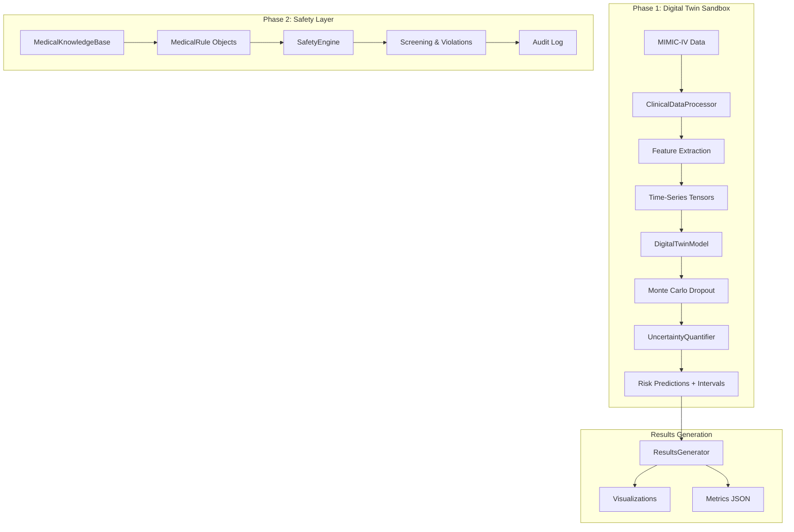

# Patent.py Architecture Documentation

## Overview

This document describes the technical architecture of `patent.py`, which implements a **Clinical AI System** for patient deterioration prediction with uncertainty quantification and safety guardrails.

The system implements two major phases from the clinical AI patent:
- **Phase 1**: Digital Twin Sandbox with Uncertainty Quantification
- **Phase 2**: Safety Layer Construction with Medical Rules

---

## System Architecture



---

## Core Components

### 1. Configuration (`Config` class)

**Location**: Lines 40-70

Centralized configuration dataclass with hyperparameters:

| Category | Parameters |
|----------|------------|
| **Data** | `min_age=18`, `min_stay_hours=24`, `time_window_hours=6` |
| **Model** | `embed_dim=64`, `hidden_dim=128`, `n_layers=2`, `dropout=0.3` |
| **Uncertainty** | `mc_samples=1000`, `uncertainty_threshold=0.4`, `confidence_level=0.9` |
| **Training** | `batch_size=32`, `epochs=30`, `lr=1e-4` |

---

### 2. Data Processing (`ClinicalDataProcessor`)

**Location**: Lines 100-450

Handles MIMIC-IV data ingestion and preprocessing:

```python
class ClinicalDataProcessor:
    """
    MIMIC-IV data loading and feature engineering.
    
    Features Extracted:
    - Vital Signs: Heart Rate, BP, SpO2, Resp Rate, Temperature
    - Lab Values: Creatinine, Lactate, WBC, Hematocrit, K+, Na+
    
    Outcomes Defined:
    - ICU Transfer within 48 hours
    - Vasopressor administration
    - Mechanical ventilation
    - In-hospital mortality
    """
```

**Key Methods**:
- `load_data()`: Load CSV files from `data_10k/`
- `select_cohort()`: Filter adults with >24h stays
- `extract_features()`: Create 6-hour time windows
- `prepare_tensors()`: Convert to PyTorch tensors

---

### 3. Digital Twin Model (`DigitalTwinModel`)

**Location**: Lines 500-650

LSTM-based architecture with Monte Carlo Dropout:

```
Input (batch, seq_len, n_features=11)
    │
    ▼
┌─────────────────────────────┐
│   Layer Normalization       │
└─────────────────────────────┘
    │
    ▼
┌─────────────────────────────┐
│   LSTM (hidden_dim=128)     │
│   - num_layers=2            │
│   - bidirectional=True      │
│   - dropout=0.3             │
└─────────────────────────────┘
    │
    ▼
┌─────────────────────────────┐
│   FC: 256 → 64 → 1          │
│   w/ Dropout (MC active)    │
└─────────────────────────────┘
    │
    ▼
Output: Deterioration Probability
```

**Monte Carlo Inference**:
```python
def predict_with_uncertainty(self, x, n_samples=1000):
    """
    Run n_samples forward passes with dropout enabled.
    Returns mean prediction and uncertainty (std).
    """
    self.train()  # Keep dropout active
    predictions = [torch.sigmoid(self(x)) for _ in range(n_samples)]
    return mean(predictions), std(predictions)
```

---

### 4. Uncertainty Quantification (`UncertaintyQuantifier`)

**Location**: Lines 700-850

Implements prediction interval calculation and calibration:

| Method | Purpose |
|--------|---------|
| `compute_prediction_intervals()` | Calculate 90% CI from MC samples |
| `flag_high_variance_patients()` | Identify uncertainty > 40% |
| `calibration_analysis()` | Check interval coverage |
| `plot_risk_trajectory()` | Visualize uncertainty cones |

---

### 5. Medical Knowledge Base (`MedicalKnowledgeBase`)

**Location**: Lines 900-1000

Repository of clinical safety rules:

```python
@dataclass
class MedicalRule:
    rule_id: str
    name: str
    conditions: Dict[str, Any]    # IF conditions
    actions: List[str]            # THEN blocked actions
    severity: RuleSeverity        # CRITICAL, WARNING, INFO
    explanation: str              # Clinical rationale
    source: str                   # AHA, KDIGO, etc.
```

**Pre-loaded Rules**:

| Rule ID | Name | Severity |
|---------|------|----------|
| `BP_STROKE` | BP Management in Stroke | CRITICAL |
| `NEPHRO_RENAL` | Nephrotoxic in Renal Impairment | CRITICAL |
| `ANTICOAG_BLEED` | Anticoagulation in Active Bleeding | CRITICAL |
| `FIO2_COPD` | High FiO2 in COPD | WARNING |
| `SEPSIS_LACTATE` | Sepsis Lactate Monitoring | WARNING |
| `BB_HF` | Beta-Blockers in Decompensated HF | CRITICAL |

---

### 6. Safety Engine (`SafetyEngine`)

**Location**: Lines 1050-1200

Real-time screening of AI recommendations:


---

### 7. Results Generator (`ResultsGenerator`)

**Location**: Lines 1135-1555

Comprehensive metrics and visualization:

**Metrics Computed**:
- AUC-ROC, AUC-PR
- F1 Score, Precision, Recall, Accuracy
- Specificity, NPV
- Brier Score (calibration)
- Confusion Matrix

**Visualizations Generated**:
- `roc_curve.png` - ROC with optimal threshold
- `pr_curve.png` - Precision-Recall curve
- `confusion_matrix.png` - Heatmap
- `calibration_curve.png` - Reliability diagram
- `uncertainty_distribution.png` - By outcome
- `training_curves_detailed.png` - Loss & AUC
- `comprehensive_dashboard.png` - All-in-one view

---

## Data Flow

```
data_10k/
├── patients_10k.csv ──────┐
├── admissions_10k.csv ────┼──► ClinicalDataProcessor
├── icustays_10k.csv ──────┤       │
├── chartevents_10k.csv ───┤       ▼
├── prescriptions_10k.csv ─┤   [Tensors + Labels]
├── inputevents_10k.csv ───┤       │
└── transfers_10k.csv ─────┘       ▼
                            DigitalTwinModel
                                   │
                                   ▼
                         UncertaintyQuantifier
                                   │
                                   ▼
                      ┌────────────┴────────────┐
                      │                         │
               SafetyEngine              ResultsGenerator
                      │                         │
                      ▼                         ▼
            safety_audit_log.json      results_summary.json
                                       *.png visualizations
```

---

## Model Architecture Details

### Input Features (11 dimensions)

| Index | Feature | Source | Range |
|-------|---------|--------|-------|
| 0 | Heart Rate | chartevents:220045 | 20-300 bpm |
| 1 | Systolic BP | chartevents:220179 | 40-250 mmHg |
| 2 | Diastolic BP | chartevents:220180 | 20-180 mmHg |
| 3 | SpO2 | chartevents:220277 | 50-100% |
| 4 | Respiratory Rate | chartevents:220210 | 4-60 /min |
| 5 | Temperature | chartevents:223761 | 32-42°C |
| 6 | Creatinine | labevents | 0-20 mg/dL |
| 7 | Lactate | labevents | 0-30 mmol/L |
| 8 | WBC | labevents | 0-100 K/μL |
| 9 | Hematocrit | labevents | 10-60% |
| 10 | Time since admission | computed | hours |

### Output

- **Probability**: P(deterioration within 48h) ∈ [0, 1]
- **Uncertainty**: σ from MC Dropout samples

---

## File Dependencies

```
patent.py
├── numpy
├── pandas
├── torch
│   ├── nn
│   ├── nn.functional
│   └── utils.data (Dataset, DataLoader)
├── sklearn
│   ├── model_selection (train_test_split)
│   ├── preprocessing (StandardScaler)
│   ├── metrics (roc_auc_score, f1_score, etc.)
│   └── calibration (calibration_curve)
├── matplotlib.pyplot
└── seaborn
```

---

## Output Files

| File | Description |
|------|-------------|
| `best_model.pt` | Trained PyTorch model weights |
| `results_summary.json` | All metrics and statistics |
| `safety_audit_log.json` | Safety violations log |
| `comprehensive_dashboard.png` | 6-panel summary |
| `roc_curve.png` | ROC with AUC |
| `pr_curve.png` | Precision-Recall curve |
| `confusion_matrix.png` | Classification matrix |
| `calibration_curve.png` | Reliability diagram |
| `uncertainty_distribution.png` | By outcome class |
| `training_curves_detailed.png` | Training progress |

---

## Usage

```bash
# Run full pipeline
python patent.py

# Expected runtime: ~5-10 minutes (depending on data size)
# GPU recommended but not required
```

---

*Documentation generated for Clinical AI System v1.0*
