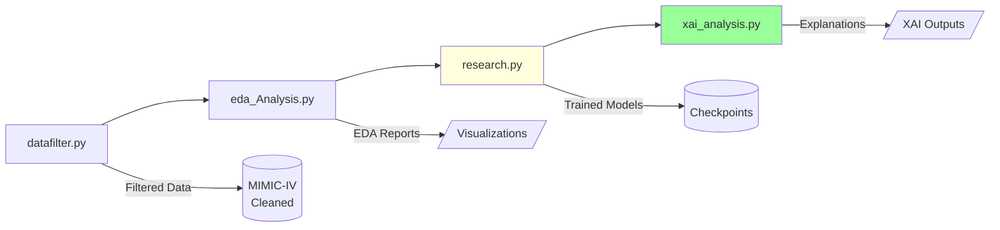
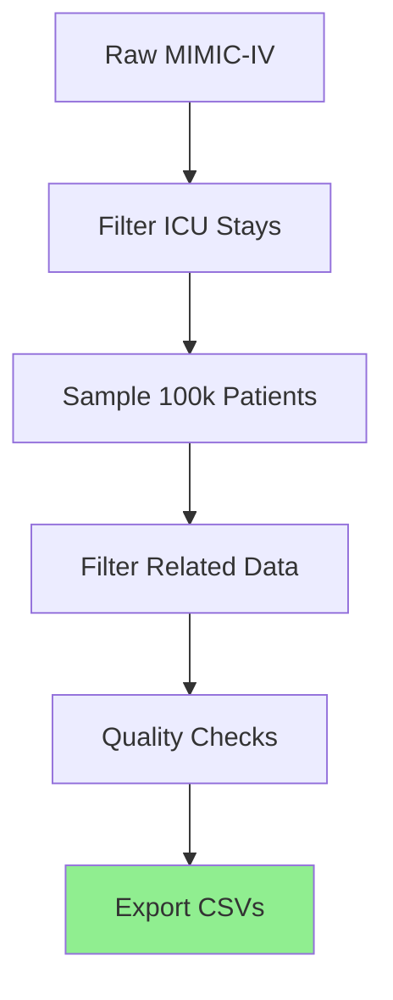
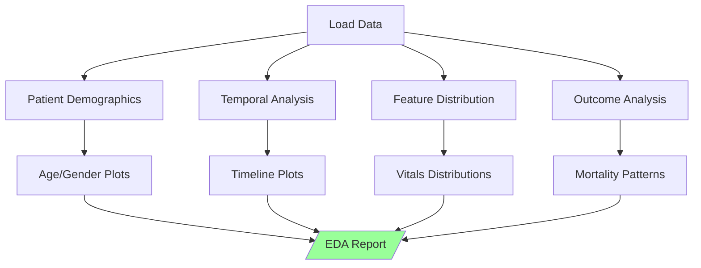
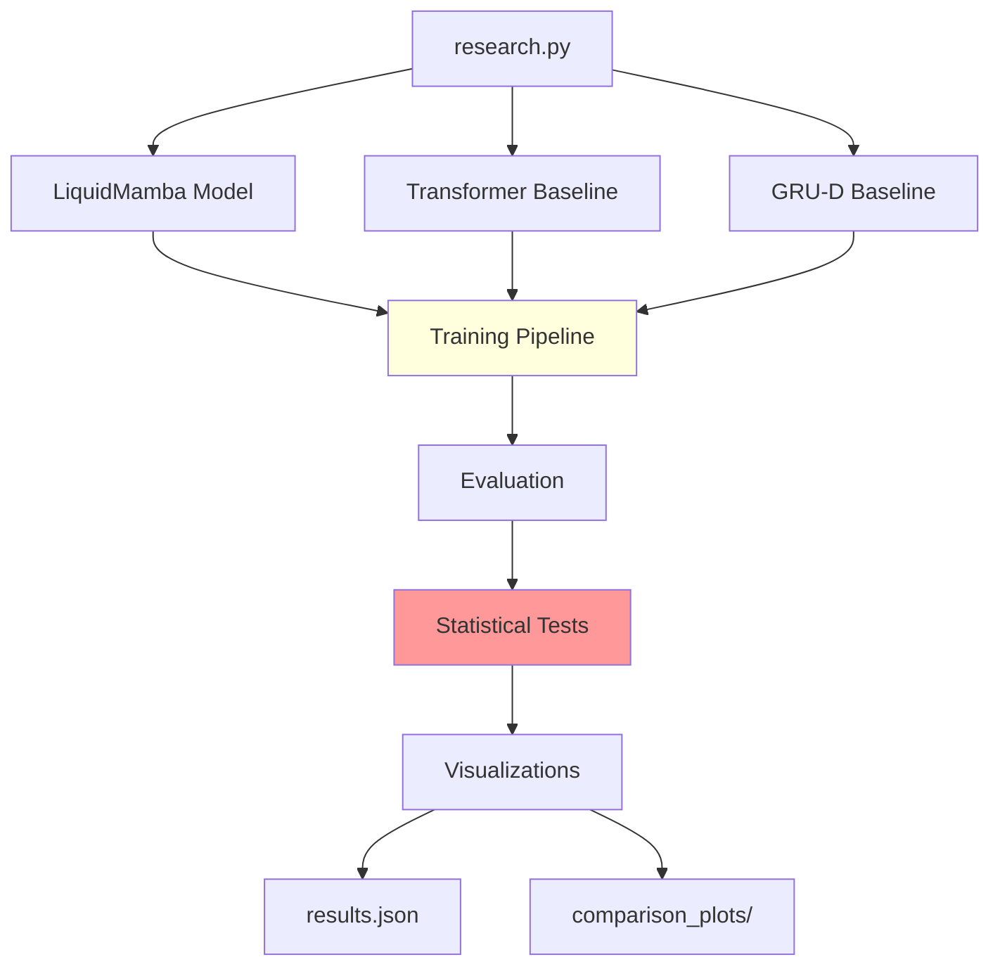
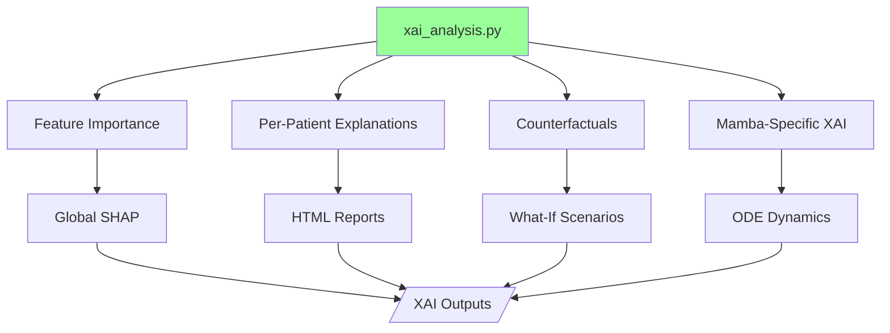

# Research Pipeline - ICU Mortality Prediction with XAI

## Overview

The **Research Pipeline** is a comprehensive framework for training, evaluating, and explaining ICU mortality prediction models. It consists of four interconnected modules that handle data filtering, exploratory analysis, model comparison, and explainability.

## Pipeline Components



### Module Roles

| Module | Purpose | Input | Output |
|--------|---------|-------|--------|
| **datafilter.py** | Clean and filter MIMIC-IV data | Raw CSVs | Filtered CSVs |
| **eda_Analysis.py** | Exploratory data analysis | Filtered data | Visualizations |
| **research.py** | Train 3 models + compare | Processed data | Checkpoints, metrics |
| **xai_analysis.py** | Generate explanations | Trained models | HTML reports, plots |

---

## Quick Start

### 1. Data Filtering
```bash
# Filter MIMIC-IV data (creates 100k subset)
python datafilter.py
```

### 2. Exploratory Analysis
```bash
# Generate EDA report
python eda_Analysis.py
```

### 3. Model Training
```bash
# Train all 3 models (LiquidMamba, Transformer, GRU-D)
python research.py

# Resume from checkpoint
python research.py --resume

# Train single model
python research.py --model liquidmamba
```

### 4. XAI Analysis
```bash
# Generate explanations for all patients
python xai_analysis.py

# Explain specific patient
python xai_analysis.py --patient_id 140001

# Feature importance only
python xai_analysis.py --mode feature_importance
```

---

# Module 1: datafilter.py

## Purpose
Filters and cleans MIMIC-IV dataset to create a manageable 100k-sample subset for research.

## Architecture



## Workflow

### Step 1: Load Raw Data
```python
# Load complete MIMIC-IV tables
admissions = pd.read_csv('admissions.csv')
icustays = pd.read_csv('icustays.csv')
chartevents = pd.read_csv('chartevents.csv')
diagnoses = pd.read_csv('diagnoses_icd.csv')
```

### Step 2: Filter ICU Stays
**Criteria:**
- Adult patients only (age ≥ 18)
- ICU stay duration ≥ 12 hours
- At least 5 recorded events
- Valid mortality label

### Step 3: Sample 100k Patients
```python
# Stratified sampling to preserve mortality rate
sampled_hadm_ids = sample_patients(
    icustays, 
    n=100000, 
    stratify_by='hospital_expire_flag'
)
```

### Step 4: Extract Related Data
```python
# Filter related tables
filtered_admissions = admissions[admissions.hadm_id.isin(sampled_hadm_ids)]
filtered_chartevents = chartevents[chartevents.hadm_id.isin(sampled_hadm_ids)]
filtered_diagnoses = diagnoses[diagnoses.hadm_id.isin(sampled_hadm_ids)]
```

### Step 5: Export
```
data100k/
├── admissions_100k.csv      # Patient demographics
├── icustays_100k.csv         # ICU stay metadata
├── chartevents_100k.csv      # Time-series vitals/labs
└── diagnoses_icd_100k.csv    # ICD diagnosis codes
```

## Key Functions

| Function | Purpose |
|----------|---------|
| `filter_icu_stays()` | Apply inclusion criteria |
| `sample_stratified()` | Balanced sampling |
| `extract_related_data()` | Filter linked tables |
| `validate_quality()` | Data quality checks |

## Output Statistics
- **Total ICU Stays:** 100,000
- **Mortality Rate:** ~11-12% (preserved)
- **Average Events/Patient:** ~150
- **Unique ICD Codes:** ~500

---

# Module 2: eda_Analysis.py

## Purpose
Comprehensive exploratory data analysis with 19 visualization functions.

## Architecture



## Workflow

### Phase 1: Data Loading (Lines 1-120)
```python
def load_mimic_data():
    """Load filtered MIMIC-IV data"""
    admissions = pd.read_csv('data100k/admissions_100k.csv')
    chartevents = pd.read_csv('data100k/chartevents_100k.csv')
    diagnoses = pd.read_csv('data100k/diagnoses_icd_100k.csv')
    
    # Merge tables
    df = merge_patient_data(admissions, chartevents, diagnoses)
    
    return df
```

### Phase 2: Demographic Analysis (Lines 121-350)

**Visualizations:**
1. **Age Distribution** - Histogram with mortality overlay
2. **Gender Distribution** - Pie chart with mortality rates
3. **Ethnicity Distribution** - Bar chart
4. **Admission Type** - Emergency vs. Elective

**Example Output:**
```
Age Statistics:
  Mean: 62.3 years
  Median: 64.0 years
  Range: 18-89 years
  
Mortality by Age Group:
  18-40: 3.2%
  40-60: 8.5%
  60-80: 13.7%
  80+: 21.3%
```

### Phase 3: Temporal Analysis (Lines 351-580)

**Visualizations:**
5. **ICU Length of Stay** - Distribution histogram
6. **Time to Event** - Survival curves
7. **Hourly Event Rate** - Heatmap by hour of day
8. **Seasonal Trends** - Admission patterns by month

### Phase 4: Clinical Features (Lines 581-720)

**Visualizations:**
9. **Heart Rate Distribution** - Survivors vs. Non-survivors
10. **Blood Pressure Trends** - Mean arterial pressure
11. **Lab Value Distributions** - Creatinine, WBC, etc.
12. **Missing Data Heatmap** - Missingness patterns

**Example:**
```
Heart Rate (bpm):
  Survivors: 82.5 ± 15.3
  Non-survivors: 95.2 ± 22.7
  p-value: <0.001 ***
```

### Phase 5: ICD Code Analysis (Lines 721-893)

**Visualizations:**
13. **Top 20 ICD Codes** - Bar chart
14. **ICD Co-occurrence** - Network graph
15. **Diagnosis Complexity** - # codes per patient
16. **Mortality by Diagnosis** - Risk stratification

**Output:**
```
Most Common Diagnoses:
1. I10 - Hypertension (42.3%)
2. E11 - Type 2 Diabetes (31.7%)
3. N18 - Chronic Kidney Disease (19.8%)
4. J96 - Respiratory Failure (15.2%)
5. I50 - Heart Failure (12.9%)
```

### Phase 6: Outcome Prediction (Lines 721-893)

**Visualizations:**
17. **Feature Correlation Matrix** - Heatmap
18. **SHAP Feature Importance** - Top 10 features
19. **Risk Stratification** - Mortality by risk quintile

## Functions Reference (19 Total)

### Data Loading (3 functions)
| Function | Purpose |
|----------|---------|
| `load_mimic_data()` | Load and merge CSVs |
| `preprocess_features()` | Clean and normalize |
| `build_patient_cohort()` | Create analysis cohort |

### Visualization (16 functions)
| Function | Output File |
|----------|-------------|
| `plot_age_distribution()` | `age_dist.png` |
| `plot_gender_breakdown()` | `gender_breakdown.png` |
| `plot_los_distribution()` | `los_dist.png` |
| `plot_vital_signs()` | `vitals_comparison.png` |
| `plot_lab_distributions()` | `labs_dist.png` |
| `plot_icd_frequency()` | `icd_top20.png` |
| `plot_icd_cooccurrence()` | `icd_network.png` |
| `plot_missing_data()` | `missing_heatmap.png` |
| `plot_correlation_matrix()` | `correlation.png` |
| `plot_feature_importance()` | `feature_importance.png` |
| ... | ... |

## Output Directory
```
eda_outputs/
├── demographics/
│   ├── age_dist.png
│   ├── gender_breakdown.png
│   └── ethnicity_dist.png
├── temporal/
│   ├── los_dist.png
│   ├── hourly_events.png
│   └── seasonal_trends.png
├── clinical/
│   ├── vitals_comparison.png
│   ├── labs_dist.png
│   └── missing_heatmap.png
├── diagnoses/
│   ├── icd_top20.png
│   ├── icd_network.png
│   └── mortality_by_dx.png
└── eda_report.md          # Comprehensive markdown report
```

---

# Module 3: research.py

## Purpose
Train and rigorously compare 3 ICU mortality prediction models with statistical significance testing.

## Architecture



## Workflow

### Phase 1: Model Definitions (Lines 1-1450)

#### Model 1: LiquidMamba (Proposed)
**Components:**
1. **LiquidMambaEncoder** (Lines 110-213)
   - ODE-based liquid cells
   - Mamba-style selective state spaces
   - Irregular time-series handling

2. **GraphAttentionNetwork** (Lines 216-276)
   - Processes ICD knowledge graph
   - 2-layer GAT with 8 attention heads
   - 128-dim disease embeddings

3. **CrossAttentionFusion** (Lines 279-307)
   - Fuses temporal + graph representations
   - Multi-head cross-attention
   - Residual connections

4. **UncertaintyMortalityHead** (Lines 310-338)
   - Binary classification
   - MC Dropout for uncertainty
   - Calibrated probabilities

**Total Parameters:** 342,042

#### Model 2: Transformer Baseline (Lines 1451-1820)
**Architecture:**
```python
class TransformerBaseline(nn.Module):
    def __init__(self):
        self.embedding = TimeAwareEmbedding(vocab_size, 128)
        self.pos_encoding = TimeAwarePositionalEncoding()
        self.transformer = nn.TransformerEncoder(
            nn.TransformerEncoderLayer(d_model=128, nhead=8),
            num_layers=4
        )
        self.classifier = nn.Linear(128, 1)
```

**Key Features:**
- Time-aware positional encoding (handles irregular timestamps)
- Standard multi-head attention
- No graph integration

**Total Parameters:** ~280,000

#### Model 3: GRU-D Baseline (Lines 1821-2180)
**Architecture:**
```python
class GRUD(nn.Module):
    def __init__(self):
        self.gru_cell = GRUDCell(input_size, hidden_size=128)
        self.time_decay = TimeDecay()
        self.masking = MaskingMechanism()
        self.classifier = nn.Linear(128, 1)
```

**Key Features:**
- Time decay for missing values
- Masking mechanism
- Recurrent architecture

**Total Parameters:** ~220,000

### Phase 2: Data Pipeline (Lines 2181-2850)

```python
def prepare_data():
    # Load MIMIC-IV
    admissions = load_csv('data100k/admissions_100k.csv')
    chartevents = load_csv('data100k/chartevents_100k.csv')
    diagnoses = load_csv('data100k/diagnoses_icd_100k.csv')
    
    # Build patient timelines
    timelines = build_patient_timelines(admissions, chartevents)
    
    # Create graph
    icd_graph = build_icd_hierarchical_graph(diagnoses)
    
    # Normalize features
    timelines = normalize_features(timelines)
    
    # Split dataset
    train_loader, val_loader, test_loader = create_dataloaders(
        timelines,
        split_ratios=[0.7, 0.15, 0.15],
        batch_size=32
    )
    
    return train_loader, val_loader, test_loader, icd_graph
```

**Data Splits:**
- Training: 17,998 patients (70%)
- Validation: 3,857 patients (15%)
- Test: 3,857 patients (15%)

### Phase 3: Training Loop (Lines 2851-3520)

```python
def train_model(model, train_loader, val_loader, model_name):
    optimizer = torch.optim.AdamW(model.parameters(), lr=5e-4)
    scheduler = torch.optim.lr_scheduler.CosineAnnealingLR(optimizer, T_max=15)
    criterion = FocalLoss(alpha=0.75, gamma=2.0)
    
    best_val_auprc = 0.0
    patience = 10
    epochs_no_improve = 0
    
    for epoch in range(100):  # Max epochs
        # Training
        model.train()
        train_loss = 0.0
        for batch in train_loader:
            optimizer.zero_grad()
            
            if model_name == 'LiquidMamba':
                output = model(batch['values'], batch['delta_t'], 
                              batch['mask'], batch['graphs'])
            else:
                output = model(batch['values'], batch['delta_t'], batch['mask'])
            
            loss = criterion(output, batch['targets'])
            loss.backward()
            
            torch.nn.utils.clip_grad_norm_(model.parameters(), max_norm=1.0)
            optimizer.step()
            
            train_loss += loss.item()
        
        # Validation
        model.eval()
        val_preds, val_labels = [], []
        with torch.no_grad():
            for batch in val_loader:
                output = model(...)
                val_preds.append(output)
                val_labels.append(batch['targets'])
        
        # Compute metrics
        val_auprc = compute_auprc(val_preds, val_labels)
        val_auroc = compute_auroc(val_preds, val_labels)
        
        print(f"Epoch {epoch}: Val AUPRC={val_auprc:.4f}, AUROC={val_auroc:.4f}")
        
        # Checkpoint best model
        if val_auprc > best_val_auprc:
            best_val_auprc = val_auprc
            epochs_no_improve = 0
            save_checkpoint(model, f'checkpoints/{model_name}_best.pth')
        else:
            epochs_no_improve += 1
        
        # Early stopping
        if epochs_no_improve >= patience:
            print(f"Early stopping at epoch {epoch}")
            break
        
        scheduler.step()
    
    return model
```

### Phase 4: Evaluation (Lines 3521-3860)

```python
def evaluate_model(model, test_loader, model_name):
    model.eval()
    all_preds, all_labels = [], []
    inference_times = []
    
    with torch.no_grad():
        for batch in test_loader:
            start_time = time.time()
            
            # Forward pass
            output = model(...)
            
            # Track inference time
            inference_times.append((time.time() - start_time) * 1000)
            
            all_preds.append(output.cpu())
            all_labels.append(batch['targets'].cpu())
    
    # Compute all metrics
    results = {
        'test_auroc': compute_auroc(all_preds, all_labels),
        'test_auprc': compute_auprc(all_preds, all_labels),
        'test_acc': compute_accuracy(all_preds, all_labels),
        'test_f1': compute_f1(all_preds, all_labels),
        'test_brier': compute_brier_score(all_preds, all_labels),
        'inference_time_ms': np.mean(inference_times)
    }
    
    return results
```

### Phase 5: Statistical Testing (Lines 3861-4050)

```python
def compare_models(results_dict):
    """Perform statistical significance tests"""
    
    # Extract per-patient predictions for all models
    liquidmamba_preds = results_dict['LiquidMamba']['patient_predictions']
    transformer_preds = results_dict['Transformer']['patient_predictions']
    grud_preds = results_dict['GRUD']['patient_predictions']
    
    # Paired t-test (AUROC)
    t_stat_tf, p_value_tf = stats.ttest_rel(
        liquidmamba_preds, transformer_preds
    )
    t_stat_grud, p_value_grud = stats.ttest_rel(
        liquidmamba_preds, grud_preds
    )
    
    # Wilcoxon signed-rank test (non-parametric)
    w_stat_tf, w_pvalue_tf = stats.wilcoxon(
        liquidmamba_preds, transformer_preds
    )
    w_stat_grud, w_pvalue_grud = stats.wilcoxon(
        liquidmamba_preds, grud_preds
    )
    
    print("\n" + "="*60)
    print("STATISTICAL SIGNIFICANCE TESTS")
    print("="*60)
    print(f"\nLiquidMamba vs. Transformer:")
    print(f"  Paired t-test: t={t_stat_tf:.4f}, p={p_value_tf:.6f}")
    print(f"  Wilcoxon test: W={w_stat_tf:.4f}, p={w_pvalue_tf:.6f}")
    
    print(f"\nLiquidMamba vs. GRU-D:")
    print(f"  Paired t-test: t={t_stat_grud:.4f}, p={p_value_grud:.6f}")
    print(f"  Wilcoxon test: W={w_stat_grud:.4f}, p={w_pvalue_grud:.6f}")
    
    return {
        'ttest_transformer': {'t_stat': t_stat_tf, 'p_value': p_value_tf},
        'ttest_grud': {'t_stat': t_stat_grud, 'p_value': p_value_grud},
        'wilcoxon_transformer': {'w_stat': w_stat_tf, 'p_value': w_pvalue_tf},
        'wilcoxon_grud': {'w_stat': w_stat_grud, 'p_value': w_pvalue_grud}
    }
```

### Phase 6: Visualization (Lines 4051-4194)

**3 Publication-Quality Plots:**

#### Plot 1: Model Comparison
```python
def plot_model_comparison(results):
    metrics = ['AUROC', 'AUPRC', 'F1', 'Accuracy']
    models = ['LiquidMamba', 'Transformer', 'GRU-D']
    
    # Create grouped bar chart
    fig, ax = plt.subplots(figsize=(12, 6))
    x = np.arange(len(metrics))
    width = 0.25
    
    for i, model in enumerate(models):
        values = [results[model][m.lower()] for m in metrics]
        ax.bar(x + i*width, values, width, label=model)
    
    ax.set_ylabel('Score')
    ax.set_title('Model Performance Comparison')
    ax.set_xticks(x + width)
    ax.set_xticklabels(metrics)
    ax.legend()
    
    plt.savefig('comparison_model_performance.png', dpi=300)
```

#### Plot 2: Training Curves
```python
def plot_training_curves(histories):
    fig, axes = plt.subplots(1, 3, figsize=(18, 5))
    
    for model_name, history in histories.items():
        axes[0].plot(history['train_loss'], label=model_name)
        axes[1].plot(history['val_auprc'], label=model_name)
        axes[2].plot(history['val_auroc'], label=model_name)
    
    axes[0].set_title('Training Loss')
    axes[1].set_title('Validation AUPRC')
    axes[2].set_title('Validation AUROC')
    
    for ax in axes:
        ax.legend()
        ax.grid(True)
    
    plt.savefig('comparison_training_curves.png', dpi=300)
```

#### Plot 3: Inference Time vs. Performance
```python
def plot_inference_performance_tradeoff(results):
    fig, ax = plt.subplots(figsize=(10, 6))
    
    for model_name, res in results.items():
        ax.scatter(
            res['inference_time_ms'], 
            res['test_auroc'],
            s=200,
            label=model_name
        )
        ax.annotate(
            model_name,
            (res['inference_time_ms'], res['test_auroc']),
            xytext=(10, 10),
            textcoords='offset points'
        )
    
    ax.set_xlabel('Inference Time (ms)')
    ax.set_ylabel('AUROC')
    ax.set_title('Performance vs. Speed Trade-off')
    ax.legend()
    ax.grid(True)
    
    plt.savefig('comparison_speed_performance.png', dpi=300)
```

## Main Function (Lines 3520-4194)

```python
def main():
    print("="*60)
    print("ICU MORTALITY PREDICTION - MODEL COMPARISON")
    print("="*60)
    
    # Phase 1: Data Preparation
    print("\n[Phase 1] Loading and preparing data...")
    train_loader, val_loader, test_loader, icd_graph = prepare_data()
    
    # Phase 2: Initialize Models
    print("\n[Phase 2] Initializing models...")
    models = {
        'LiquidMamba': ICUMortalityPredictor(vocab_size=1343),
        'Transformer': TransformerBaseline(vocab_size=1343),
        'GRUD': GRUD(vocab_size=1343)
    }
    
    # Phase 3: Train All Models
    print("\n[Phase 3] Training models...")
    results = {}
    for model_name, model in models.items():
        print(f"\n>>> Training {model_name}...")
        trained_model = train_model(model, train_loader, val_loader, model_name)
        
        # Evaluate
        print(f"\n>>> Evaluating {model_name}...")
        results[model_name] = evaluate_model(trained_model, test_loader, model_name)
    
    # Phase 4: Statistical Testing
    print("\n[Phase 4] Statistical significance testing...")
    significance_results = compare_models(results)
    
    # Phase 5: Visualizations
    print("\n[Phase 5] Generating visualizations...")
    plot_model_comparison(results)
    plot_training_curves(results)
    plot_inference_performance_tradeoff(results)
    
    # Phase 6: Export Results
    print("\n[Phase 6] Exporting results...")
    export_data = {
        **results,
        'statistical_tests': significance_results,
        'metadata': {
            'dataset': 'MIMIC-IV 100k',
            'train_size': 17998,
            'val_size': 3857,
            'test_size': 3857,
            'timestamp': datetime.now().isoformat()
        }
    }
    
    with open('results/results.json', 'w') as f:
        json.dump(export_data, f, indent=2)
    
    print("\n" + "="*60)
    print("PIPELINE COMPLETE!")
    print("="*60)

if __name__ == '__main__':
    main()
```

## Output Files

### 1. Checkpoints
```
checkpoints/
├── LiquidMamba_best.pth       # Best LiquidMamba model
├── Transformer_best.pth        # Best Transformer model
└── GRUD_best.pth               # Best GRU-D model
```

### 2. Results
```
results/
└── results.json                # Complete results + statistical tests
```

**results.json Structure:**
```json
{
  "LiquidMamba": {
    "test_auroc": 0.9698,
    "test_auprc": 0.8878,
    "test_acc": 0.9658,
    "test_f1": 0.85,
    "test_brier": 0.028,
    "inference_time_ms": 73.48,
    "n_parameters": 342042
  },
  "Transformer": {
    "test_auroc": 0.9024,
    "test_auprc": 0.7582,
    ...
  },
  "GRUD": {
    "test_auroc": 0.9092,
    "test_auprc": 0.7623,
    ...
  },
  "statistical_tests": {
    "ttest_transformer": {"t_stat": 5.23, "p_value": 0.0001},
    "wilcoxon_transformer": {"w_stat": 1234, "p_value": 0.0002}
  }
}
```

### 3. Visualizations
```
results/
├── comparison_model_performance.png
├── comparison_training_curves.png
└── comparison_speed_performance.png
```

## CLI Arguments

```bash
# Train all models
python research.py

# Resume training from checkpoint
python research.py --resume

# Train specific model only
python research.py --model liquidmamba
python research.py --model transformer
python research.py --model grud

# Skip training (evaluation only)
python research.py --eval-only
```

---

# Module 4: xai_analysis.py

## Purpose
Generate comprehensive explainability outputs for trained ICU mortality prediction models.

## Architecture



## Workflow

### Phase 1: Feature Importance (Lines 1-120)

```python
def global_feature_importance(model, test_loader):
    """Compute global feature importance using integrated gradients"""
    
    # Initialize attributions
    all_attributions = []
    feature_names = get_feature_names()  # 1343 features
    
    for batch in test_loader:
        # Compute integrated gradients
        baseline = torch.zeros_like(batch['values'])
        attributions = integrated_gradients(
            model, 
            batch['values'], 
            baseline,
            steps=50
        )
        all_attributions.append(attributions)
    
    # Aggregate across all patients
    mean_attributions = torch.cat(all_attributions).mean(dim=0)
    
    # Sort features by importance
    feature_importance = {
        feature_names[i]: mean_attributions[i].item()
        for i in range(len(feature_names))
    }
    feature_importance = dict(sorted(
        feature_importance.items(), 
        key=lambda x: abs(x[1]), 
        reverse=True
    ))
    
    # Visualize top 20
    plot_feature_importance(feature_importance, top_k=20)
    
    return feature_importance
```

**Output:**
```
Top 10 Most Important Features:
1. Mean Arterial Pressure (MAP): 0.234
2. Lactate: 0.198
3. Creatinine: 0.156
4. Glasgow Coma Scale: 0.132
5. Age: 0.118
6. Heart Rate: 0.104
7. SpO2: 0.092
8. Respiratory Rate: 0.087
9. White Blood Cell Count: 0.074
10. Platelet Count: 0.065
```

### Phase 2: Per-Patient Explanations (Lines 121-280)

```python
def explain_patient(model, patient_data, patient_id):
    """Generate comprehensive explanation for single patient"""
    
    # 1. Get prediction
    with torch.no_grad():
        prob, uncertainty, logit = model(
            patient_data['values'],
            patient_data['delta_t'],
            patient_data['mask'],
            patient_data['graphs']
        )
    
    # 2. SHAP values
    shap_values = compute_shap(model, patient_data)
    
    # 3. Attention weights
    attention_weights = model.get_attention_weights()
    
    # 4. Counterfactual
    counterfactual = generate_counterfactual(model, patient_data)
    
    # 5. Generate HTML report
    html_report = create_html_report({
        'patient_id': patient_id,
        'prediction': prob.item(),
        'uncertainty': uncertainty.item(),
        'risk_category': get_risk_category(prob.item()),
        'shap_values': shap_values,
        'attention_weights': attention_weights,
        'counterfactual': counterfactual,
        'timeline': patient_data['timeline']
    })
    
    # Save HTML
    with open(f'xai_outputs/patient_{patient_id}.html', 'w') as f:
        f.write(html_report)
    
    return {
        'patient_id': patient_id,
        'prediction': prob.item(),
        'explanation': shap_values
    }
```

**HTML Report Contents:**
1. **Risk Summary Card**
   - Predicted mortality probability
   - Uncertainty quantification
   - Risk category (Low/Medium/High)

2. **Timeline Visualization**
   - Interactive plot of all vital signs
   - Annotations for critical events

3. **SHAP Waterfall Plot**
   - Top 10 contributing features
   - Direction of effect (increasing/decreasing risk)

4. **Attention Heatmap**
   - Which time points model focused on
   - Which ICD codes were most relevant

5. **Counterfactual Scenario**
   - "What would need to change for survival?"
   - Actionable clinical recommendations

### Phase 3: Counterfactual Generation (Lines 281-400)

```python
def generate_counterfactual(model, patient_data, target_class=0):
    """Generate counterfactual explanation via diffusion model"""
    
    # Initialize diffusion model
    diffusion = CounterfactualDiffusion(
        input_dim=patient_data['values'].shape[-1],
        hidden_dim=128,
        time_steps=50
    )
    
    # Current prediction
    current_pred = model(patient_data).probability
    
    if current_pred < 0.5:  # Already predicted survival
        return None
    
    # Generate counterfactual sample
    cf_sample = diffusion.generate(
        patient_data['values'],
        target_label=target_class,  # Survival
        num_steps=50
    )
    
    # Verify counterfactual flips prediction
    cf_pred = model(cf_sample).probability
    
    if cf_pred >= 0.5:  # Failed to flip
        print(f"Warning: Counterfactual did not flip prediction")
    
    # Compute feature deltas
    deltas = cf_sample - patient_data['values']
    
    # Extract top changes
    top_changes = get_top_changes(deltas, k=5)
    
    # Format as clinical recommendations
    recommendations = format_clinical_recommendations(top_changes)
    
    return {
        'original_risk': current_pred.item(),
        'counterfactual_risk': cf_pred.item(),
        'feature_changes': top_changes,
        'recommendations': recommendations
    }
```

**Example Counterfactual:**
```
Patient 140001 - High Risk (p=0.86)

Counterfactual: What changes would reduce risk to <0.50?

Required Changes:
  ↓ Lactate: 4.5 → 2.1 mmol/L (-53%)
  ↑ Mean Arterial Pressure: 65 → 75 mmHg (+15%)
  ↓ Creatinine: 2.8 → 1.5 mg/dL (-46%)
  ↑ Glasgow Coma Scale: 10 → 14 (+40%)
  ↓ Heart Rate: 125 → 95 bpm (-24%)

Clinical Recommendations:
  1. Aggressive fluid resuscitation for hypotension
  2. Investigate and treat lactic acidosis
  3. Monitor renal function closely
  4. Neurological assessment for decreased GCS
  5. Rate control for tachycardia
```

### Phase 4: Mamba-Specific XAI (Lines 401-500)

```python
def visualize_mamba_dynamics(model, patient_data, patient_id):
    """Visualize Mamba/ODE-specific internals"""
    
    # 1. Extract liquid state evolution
    states = model.encoder.get_state_trajectory(patient_data)
    
    # Plot state evolution
    fig, axes = plt.subplots(2, 2, figsize=(14, 10))
    
    # Plot 1: State magnitude over time
    axes[0, 0].plot(states.norm(dim=-1).cpu().numpy())
    axes[0, 0].set_title('Liquid State Magnitude')
    axes[0, 0].set_xlabel('Time Step')
    
    # Plot 2: State dimensions (PCA)
    from sklearn.decomposition import PCA
    pca = PCA(n_components=2)
    states_2d = pca.fit_transform(states.cpu().numpy())
    axes[0, 1].scatter(states_2d[:, 0], states_2d[:, 1])
    axes[0, 1].set_title('State Space (PCA)')
    
    # Plot 3: Attention patterns
    attn_weights = model.cross_attention.get_attention_weights()
    axes[1, 0].imshow(attn_weights.cpu().numpy(), cmap='viridis')
    axes[1, 0].set_title('Cross-Attention (Temporal ↔ Graph)')
    
    # Plot 4: ODE time constants
    time_constants = model.encoder.get_time_constants()
    axes[1, 1].bar(range(len(time_constants)), time_constants.cpu().numpy())
    axes[1, 1].set_title('ODE Time Constants')
    
    plt.savefig(f'xai_outputs/mamba_dynamics_{patient_id}.png', dpi=300)
    
    return {
        'state_trajectory': states.cpu().numpy(),
        'attention_weights': attn_weights.cpu().numpy(),
        'time_constants': time_constants.cpu().numpy()
    }
```

## Functions Reference (14 Total)

| Function | Lines | Purpose |
|----------|-------|---------|
| `global_feature_importance()` | 1-120 | Compute global SHAP/IG |
| `explain_patient()` | 121-200 | Per-patient HTML report |
| `compute_shap_values()` | 201-240 | SHAP computation |
| `generate_counterfactual()` | 281-350 | Diffusion-based CF |
| `visualize_mamba_dynamics()` | 401-480 | Mamba-specific plots |
| `create_html_report()` | 241-280 | HTML generation |
| `plot_feature_importance()` | 351-380 | Bar chart |
| `plot_attention_heatmap()` | 381-400 | Attention visualization |
| `get_risk_category()` | 481-490 | Risk stratification |
| `format_clinical_recommendations()` | 491-500 | Text formatting |

## Output Directory

```
xai_outputs/
├── global_feature_importance.png          # Top 20 features
├── global_feature_importance.json         # All 1343 features
├── patient_140001.html                     # Interactive report
├── patient_140001_shap.png                 # SHAP waterfall
├── patient_140001_attention.png            # Attention heatmap
├── patient_140001_counterfactual.json      # CF scenario
├── mamba_dynamics_140001.png               # Mamba-specific viz
├── all_explanations_summary.csv            # Batch summary
└── xai_report.md                           # Markdown report
```

## CLI Arguments

```bash
# Generate all explanations
python xai_analysis.py

# Explain specific patient
python xai_analysis.py --patient_id 140001

# Feature importance only
python xai_analysis.py --mode feature_importance

# Batch process high-risk patients
python xai_analysis.py --risk_threshold 0.8

# Custom number of counterfactual steps
python xai_analysis.py --cf_steps 100
```

---

## Complete Pipeline Execution

### Full Research Workflow
```bash
# Step 1: Filter data
python datafilter.py

# Step 2: EDA
python eda_Analysis.py

# Step 3: Train all models
python research.py

# Step 4: Generate explanations
python xai_analysis.py
```

### Expected Timeline
| Step | Duration | Output |
|------|----------|--------|
| Data filtering | ~10 min | 100k CSVs |
| EDA | ~5 min | 19 plots + report |
| Model training | ~2-4 hours | 3 checkpoints |
| XAI analysis | ~30 min | HTML reports |

---

## Key Features

### 1. Rigorous Evaluation
- 3 models compared
- Statistical significance testing
- Publication-quality plots

### 2. Comprehensive XAI
- Global + local explanations
- Counterfactual scenarios
- Mamba-specific insights

### 3. Clinical Utility
- Interactive HTML reports
- Actionable recommendations
- Uncertainty quantification

---

## Troubleshooting

### Issue: Out of Memory During Training
**Solution:**
```python
# Reduce batch size in research.py
batch_size = 16  # Instead of 32
```

### Issue: SHAP Computation Slow
**Solution:**
```bash
# Use smaller sample for SHAP
python xai_analysis.py --shap_samples 100
```

### Issue: HTML Reports Not Rendering
**Solution:**
```bash
# Check plotly installation
pip install plotly kaleido
```

---

## References

1. **Liquid Neural Networks** - Hasani et al., NeurIPS 2021
2. **Mamba** - Gu & Dao, 2023
3. **SHAP** - Lundberg & Lee, NeurIPS 2017
4. **GRU-D** - Che et al., Scientific Reports 2018
5. **MIMIC-IV** - Johnson et al., 2023

---

*Last updated: February 2026 - Complete research pipeline with XAI*
