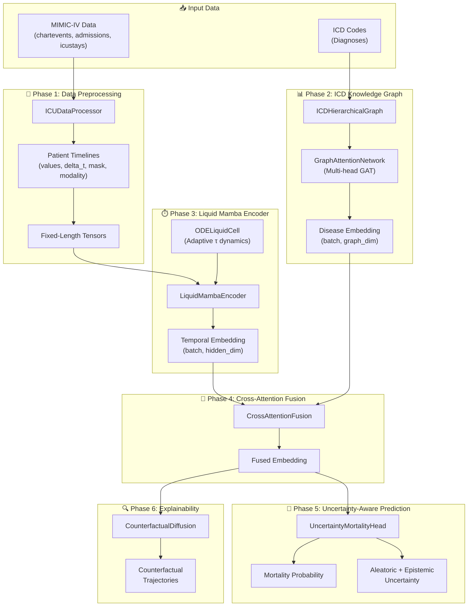

# ICU Mortality Prediction System - Architecture

## Overview

This document describes the technical architecture of the **ICU Mortality Prediction System** implemented in `research.py`. The system combines state-of-the-art deep learning techniques to predict in-hospital mortality for ICU patients using irregular time-series data and disease knowledge graphs.

---

## System Architecture Diagram



---

## Component Details

### Phase 1: Data Preprocessing (`ICUDataProcessor`)

| Component | Description |
|-----------|-------------|
| **Location** | Lines 88-363 |
| **Input** | MIMIC-IV CSV files (`admissions`, `icustays`, `chartevents`, `inputevents`, `outputevents`) |
| **Output** | Fixed-length tensors with patient timelines |

**Key Features:**
- **Physiological Range Clipping**: Enforces clinical validity (e.g., HR: 20-300 bpm)
- **Log Transform**: Applied to skewed labs (Creatinine, Lactate, BUN, Bilirubin)
- **Gap-Awareness**: Computes `delta_t` (time since last observation) in hours
- **Modality Tags**: Distinguishes chartevents (0), inputevents (1), outputevents (2)
- **Missingness Masks**: Binary indicator for observed vs missing values

```python
# Output tensor structure per patient:
{
    'values': torch.Tensor,      # Normalized feature values
    'delta_t': torch.Tensor,     # Time gaps (hours)
    'mask': torch.Tensor,        # Observation mask
    'modality': torch.Tensor,    # Event type (0/1/2)
    'item_idx': torch.Tensor,    # Feature vocabulary index
    'length': int                # Actual sequence length
}
```

---

### Phase 2: ICD Knowledge Graph (`ICDHierarchicalGraph` + `GraphAttentionNetwork`)

| Component | Description |
|-----------|-------------|
| **Graph Construction** | Lines 370-472 |
| **GAT Network** | Lines 475-555 |
| **Input** | ICD diagnosis codes per patient |
| **Output** | Patient comorbidity embedding `(batch, graph_dim)` |

**Graph Structure:**
- **Nodes**: ICD-10 codes (all unique codes in dataset)
- **Edges**: 
  1. **Hierarchical** - Based on ICD prefix similarity
  2. **Co-occurrence** - Diseases appearing together in patients

**Graph Attention Network:**
```
Node Embeddings (n_nodes, embed_dim)
        ↓
Multi-Head Attention (4 heads)
        ↓
Adjacency-Masked Attention Scores
        ↓
Weighted Aggregation
        ↓
Patient Comorbidity Embedding
```

---

### Phase 3: Liquid Mamba Encoder (`ODELiquidCell` + `LiquidMambaEncoder`)

| Component | Description |
|-----------|-------------|
| **ODE Cell** | Lines 565-631 |
| **Encoder** | Lines 634-709 |
| **Input** | Patient timeline tensors |
| **Output** | Temporal embedding `(batch, hidden_dim)` |

**Mathematical Foundation:**

The Liquid Neural Network uses an ODE-based formulation:

$$\frac{dh}{dt} = \frac{1}{\tau(\Delta t)} \cdot (\sigma(W_x \cdot x + W_h \cdot h + b) - h)$$

Where:
- **τ(Δt)** = Adaptive time constant based on observation gap
- **Small Δt** → Large τ → Slow dynamics (frequent vitals)
- **Large Δt** → Small τ → Fast adaptation (sparse labs)

**Discretization (Euler):**
$$h_{t+1} = h_t + \Delta t \cdot \frac{dh}{dt}$$

---

### Phase 4: Cross-Attention Fusion (`CrossAttentionFusion`)

| Component | Description |
|-----------|-------------|
| **Location** | Lines 716-759 |
| **Input** | Temporal embedding + Graph embedding |
| **Output** | Fused embedding `(batch, temporal_dim)` |

**Architecture:**
```
[Temporal Emb] + [Graph Emb]
         ↓ Concatenate
    Fusion MLP (2 layers)
         ↓
    Layer Norm + Residual
         ↓
    Fused Embedding
```

---

### Phase 5: Uncertainty-Aware Mortality Head (`UncertaintyMortalityHead`)

| Component | Description |
|-----------|-------------|
| **Location** | Lines 766-821 |
| **Input** | Fused embedding |
| **Output** | Probability, Uncertainty, Logit |

**Uncertainty Types:**

| Type | Method | Interpretation |
|------|--------|----------------|
| **Aleatoric** | Learned log-variance head | Data/noise uncertainty |
| **Epistemic** | MC Dropout (10 samples) | Model uncertainty |

---

### Phase 6: Counterfactual Diffusion (`CounterfactualDiffusion`)

| Component | Description |
|-----------|-------------|
| **Location** | Lines 828-937 |
| **Input** | Patient embedding + target outcome |
| **Output** | Counterfactual trajectory |

**Purpose:** Generates "what-if" scenarios showing minimal changes needed for survival, providing actionable clinical insights.

---

## Complete Model (`ICUMortalityPredictor`)

| Location | Lines 944-1031 |
|----------|----------------|

**Forward Pass:**
```python
def forward(values, delta_t, mask, modality, item_idx, icd_activation, icd_adj):
    # 1. Temporal encoding
    temporal_emb, hidden_states = temporal_encoder(values, delta_t, mask, modality, item_idx)
    
    # 2. Graph encoding
    graph_emb, node_attention = graph_encoder(icd_activation, icd_adj)
    
    # 3. Fusion
    fused_emb = fusion(temporal_emb, graph_emb)
    
    # 4. Prediction
    prob, uncertainty, logit = mortality_head(fused_emb)
    
    return prob, uncertainty, logit
```

---

## Configuration

```python
@dataclass
class Config:
    # Data
    data_dir: str = "data_10k"
    max_seq_len: int = 128
    
    # Model Architecture
    embed_dim: int = 64          # Base embedding dimension
    hidden_dim: int = 128        # Liquid Mamba hidden dim
    graph_dim: int = 64          # ICD graph embedding dim
    n_mamba_layers: int = 2      # Number of Liquid Mamba layers
    n_attention_heads: int = 4   # Cross-attention heads
    dropout: float = 0.2
    
    # Training
    batch_size: int = 8
    epochs: int = 50
    lr: float = 1e-3
    
    # Diffusion XAI
    diffusion_steps: int = 50
    
    # Uncertainty
    mc_dropout_samples: int = 10
```

---

## Output Artifacts

| File | Description |
|------|-------------|
| `checkpoints/best_model.pt` | Best model weights + metadata |
| `results/metrics.json` | Test metrics (AUROC, AUPRC, Brier, etc.) |
| `results/training_curves.png` | Loss/accuracy over epochs |
| `results/calibration.png` | Reliability diagram |
| `results/uncertainty_analysis.png` | Uncertainty vs accuracy |
| `results/dca.png` | Decision Curve Analysis |
