# ICU Mortality Prediction System - Architecture

## Overview

This document describes the technical architecture of the **ICU Mortality Prediction System** implemented in `research.py`. The system combines state-of-the-art deep learning techniques to predict in-hospital mortality for ICU patients using irregular time-series data and disease knowledge graphs.

---

## Data Source & Patient Selection

### Data Files Loaded

`research.py` loads the following **7 MIMIC-IV files** from the `data_10k/` directory:

| File | Purpose | Key Columns | Memory Strategy |
|------|---------|-------------|-----------------|
| `admissions_10k.csv` | Mortality labels | `hadm_id`, `hospital_expire_flag` | Full load |
| `icustays_10k.csv` | ICU stay periods | `stay_id`, `hadm_id`, `intime`, `outtime` | Full load |
| `drgcodes_10k.csv` | **Diagnosis codes** | `hadm_id`, `drg_code`, `description` | Full load |
| `chartevents_10k.csv` | Vitals & labs | `charttime`, `itemid`, `valuenum` | **Chunked (~2M rows)** |
| `inputevents_10k.csv` | Medications/fluids | `starttime`, `itemid`, `amount` | Limited (500K rows) |
| `outputevents_10k.csv` | Outputs (urine, etc.) | `charttime`, `itemid`, `value` | Full load |
| `procedureevents_10k.csv` | Procedures | `starttime`, `itemid` | Full load |

> [!NOTE]
> **DRG codes** (Diagnosis-Related Groups) from `drgcodes_10k.csv` are used to build the disease knowledge graph. These provide real diagnosis information for each hospital admission.

### Patient Selection Criteria

The system applies **strict criteria** to ensure high-quality timelines:

| Criterion | Threshold | Rationale |
|-----------|-----------|-----------|
| **Data Source** | ICU stays only | Focus on critical care |
| **Minimum Events** | ≥ 5 per patient | Ensures sufficient temporal data |
| **Valid Values** | Non-null `valuenum` | Only measured observations |

```python
# Critical filter: Skip patients with sparse data
if len(patient_events) < 5:
    continue  # Excluded from cohort
```

### Resulting Cohort Statistics

| Metric | Value |
|--------|-------|
| **Total ICU Stays** | ~2,292 |
| **Mortality Rate** | ~11.6% |
| **Train Samples** | 1,604 (11.7% mortality) |
| **Validation Samples** | 344 (11.6% mortality) |
| **Test Samples** | 344 (11.6% mortality) |

### Outcome Definition

Mortality is defined as:
- `hospital_expire_flag = 1` (patient died during hospital stay)

> [!NOTE]
> The **11.6% mortality rate** reflects in-hospital death only, which is lower than the 21.2% deterioration rate in `patent.py` because it excludes non-fatal adverse events.

### Why Fewer Samples Than `patent.py`?

| Factor | `patent.py` (11,550) | `research.py` (2,292) |
|--------|----------------------|----------------------|
| **Unit of Analysis** | All hospital admissions | ICU stays only |
| **Minimum Events** | No minimum | ≥ 5 events required |
| **Data Completeness** | 6-hour aggregated windows | Raw event timelines |
| **Memory Limits** | Full data | Chunked/sampled |

The Liquid Mamba model in `research.py` requires **dense, high-quality temporal sequences**, hence the stricter filtering.

---

## System Architecture Diagram

```mermaid
flowchart TB
    subgraph Input["📥 Input Data"]
        MIMIC["MIMIC-IV Data<br/>(chartevents, admissions, icustays)"]
        ICD["ICD Codes<br/>(Diagnoses)"]
    end
    
    subgraph Preprocessing["🔧 Phase 1: Data Preprocessing"]
        Processor["ICUDataProcessor"]
        Timeline["Patient Timelines<br/>(values, delta_t, mask, modality)"]
        Tensors["Fixed-Length Tensors"]
    end
    
    subgraph GraphModule["📊 Phase 2: ICD Knowledge Graph"]
        ICDGraph["ICDHierarchicalGraph"]
        GAT["GraphAttentionNetwork<br/>(Multi-head GAT)"]
        GraphEmb["Disease Embedding<br/>(batch, graph_dim)"]
    end
    
    subgraph TemporalModule["⏱️ Phase 3: Liquid Mamba Encoder"]
        ODE["ODELiquidCell<br/>(Adaptive τ dynamics)"]
        Mamba["LiquidMambaEncoder"]
        TempEmb["Temporal Embedding<br/>(batch, hidden_dim)"]
    end
    
    subgraph Fusion["🔗 Phase 4: Cross-Attention Fusion"]
        CrossAttn["CrossAttentionFusion"]
        FusedEmb["Fused Embedding"]
    end
    
    subgraph Prediction["🎯 Phase 5: Uncertainty-Aware Prediction"]
        MortHead["UncertaintyMortalityHead"]
        Prob["Mortality Probability"]
        Uncert["Aleatoric + Epistemic<br/>Uncertainty"]
    end
    
    subgraph XAI["🔍 Phase 6: Explainability"]
        Diffusion["CounterfactualDiffusion"]
        CF["Counterfactual<br/>Trajectories"]
    end
    
    MIMIC --> Processor
    Processor --> Timeline --> Tensors
    ICD --> ICDGraph --> GAT --> GraphEmb
    Tensors --> Mamba
    ODE --> Mamba --> TempEmb
    TempEmb --> CrossAttn
    GraphEmb --> CrossAttn
    CrossAttn --> FusedEmb --> MortHead
    MortHead --> Prob
    MortHead --> Uncert
    FusedEmb --> Diffusion --> CF
```



---

## Component Details

### Phase 1: Data Preprocessing (`ICUDataProcessor`)

| Component | Description |
|-----------|-------------|
| **Location** | Lines 88-363 |
| **Input** | MIMIC-IV CSV files (`admissions`, `icustays`, `chartevents`, `inputevents`, `outputevents`) |
| **Output** | Fixed-length tensors with patient timelines |

**Key Features:**
- **Physiological Range Clipping**: Enforces clinical validity (e.g., HR: 20-300 bpm)
- **Log Transform**: Applied to skewed labs (Creatinine, Lactate, BUN, Bilirubin)
- **Gap-Awareness**: Computes `delta_t` (time since last observation) in hours
- **Modality Tags**: Distinguishes chartevents (0), inputevents (1), outputevents (2)
- **Missingness Masks**: Binary indicator for observed vs missing values

```python
# Output tensor structure per patient:
{
    'values': torch.Tensor,      # Normalized feature values
    'delta_t': torch.Tensor,     # Time gaps (hours)
    'mask': torch.Tensor,        # Observation mask
    'modality': torch.Tensor,    # Event type (0/1/2)
    'item_idx': torch.Tensor,    # Feature vocabulary index
    'length': int                # Actual sequence length
}
```

---

### Phase 2: ICD Knowledge Graph (`ICDHierarchicalGraph` + `GraphAttentionNetwork`)

| Component | Description |
|-----------|-------------|
| **Graph Construction** | Lines 370-472 |
| **GAT Network** | Lines 475-555 |
| **Input** | ICD diagnosis codes per patient |
| **Output** | Patient comorbidity embedding `(batch, graph_dim)` |

**Graph Structure:**
- **Nodes**: ICD-10 codes (all unique codes in dataset)
- **Edges**: 
  1. **Hierarchical** - Based on ICD prefix similarity
  2. **Co-occurrence** - Diseases appearing together in patients

**Graph Attention Network:**
```
Node Embeddings (n_nodes, embed_dim)
        ↓
Multi-Head Attention (4 heads)
        ↓
Adjacency-Masked Attention Scores
        ↓
Weighted Aggregation
        ↓
Patient Comorbidity Embedding
```

---

### Phase 3: Liquid Mamba Encoder (`ODELiquidCell` + `LiquidMambaEncoder`)

| Component | Description |
|-----------|-------------|
| **ODE Cell** | Lines 565-631 |
| **Encoder** | Lines 634-709 |
| **Input** | Patient timeline tensors |
| **Output** | Temporal embedding `(batch, hidden_dim)` |

**Mathematical Foundation:**

The Liquid Neural Network uses an ODE-based formulation:

$$\frac{dh}{dt} = \frac{1}{\tau(\Delta t)} \cdot (\sigma(W_x \cdot x + W_h \cdot h + b) - h)$$

Where:
- **τ(Δt)** = Adaptive time constant based on observation gap
- **Small Δt** → Large τ → Slow dynamics (frequent vitals)
- **Large Δt** → Small τ → Fast adaptation (sparse labs)

**Discretization (Euler):**
$$h_{t+1} = h_t + \Delta t \cdot \frac{dh}{dt}$$

---

### Phase 4: Cross-Attention Fusion (`CrossAttentionFusion`)

| Component | Description |
|-----------|-------------|
| **Location** | Lines 716-759 |
| **Input** | Temporal embedding + Graph embedding |
| **Output** | Fused embedding `(batch, temporal_dim)` |

**Architecture:**
```
[Temporal Emb] + [Graph Emb]
         ↓ Concatenate
    Fusion MLP (2 layers)
         ↓
    Layer Norm + Residual
         ↓
    Fused Embedding
```

---

### Phase 5: Uncertainty-Aware Mortality Head (`UncertaintyMortalityHead`)

| Component | Description |
|-----------|-------------|
| **Location** | Lines 766-821 |
| **Input** | Fused embedding |
| **Output** | Probability, Uncertainty, Logit |

**Uncertainty Types:**

| Type | Method | Interpretation |
|------|--------|----------------|
| **Aleatoric** | Learned log-variance head | Data/noise uncertainty |
| **Epistemic** | MC Dropout (10 samples) | Model uncertainty |

---

### Phase 6: Counterfactual Diffusion (`CounterfactualDiffusion`)

| Component | Description |
|-----------|-------------|
| **Location** | Lines 828-937 |
| **Input** | Patient embedding + target outcome |
| **Output** | Counterfactual trajectory |

**Purpose:** Generates "what-if" scenarios showing minimal changes needed for survival, providing actionable clinical insights.

---

## Complete Model (`ICUMortalityPredictor`)

| Location | Lines 944-1031 |
|----------|----------------|

**Forward Pass:**
```python
def forward(values, delta_t, mask, modality, item_idx, icd_activation, icd_adj):
    # 1. Temporal encoding
    temporal_emb, hidden_states = temporal_encoder(values, delta_t, mask, modality, item_idx)
    
    # 2. Graph encoding
    graph_emb, node_attention = graph_encoder(icd_activation, icd_adj)
    
    # 3. Fusion
    fused_emb = fusion(temporal_emb, graph_emb)
    
    # 4. Prediction
    prob, uncertainty, logit = mortality_head(fused_emb)
    
    return prob, uncertainty, logit
```

---

## Configuration

```python
@dataclass
class Config:
    # Data
    data_dir: str = "data_10k"
    max_seq_len: int = 128
    
    # Model Architecture
    embed_dim: int = 64          # Base embedding dimension
    hidden_dim: int = 128        # Liquid Mamba hidden dim
    graph_dim: int = 64          # ICD graph embedding dim
    n_mamba_layers: int = 2      # Number of Liquid Mamba layers
    n_attention_heads: int = 4   # Cross-attention heads
    dropout: float = 0.2
    
    # Training
    batch_size: int = 8
    epochs: int = 50
    lr: float = 1e-3
    
    # Diffusion XAI
    diffusion_steps: int = 50
    
    # Uncertainty
    mc_dropout_samples: int = 10
```

---

## Output Artifacts

### Model & Metrics
| File | Description |
|------|-------------|
| `checkpoints/best_model.pt` | Best model weights + metadata |
| `results/metrics.json` | Test metrics (AUROC, AUPRC, Brier, etc.) |

### Training Visualizations
| File | Description |
|------|-------------|
| `results/training_curves.png` | Loss/AUROC/AUPRC over epochs |
| `results/calibration.png` | Reliability diagram |
| `results/uncertainty_analysis.png` | Uncertainty vs prediction |
| `results/dca.png` | Decision Curve Analysis |

### Explainable AI (XAI) Outputs
| File | Description |
|------|-------------|
| `results/counterfactual_explanations.json` | Per-patient counterfactual results |
| `results/feature_importance.json` | Feature importance via gradient saliency |
| `results/feature_importance.png` | Clinical feature importance bar chart |
| `results/counterfactual_analysis.png` | Proximity vs sparsity trade-off plots |
| `results/xai_dashboard.png` | **Comprehensive 4-panel XAI dashboard** |
