# ICU Mortality Prediction System - Logic & Methodology

## Overview

This document explains the **logical flow and methodology** behind the ICU Mortality Prediction System implemented in `research.py`. It covers the clinical reasoning, data handling, and algorithmic choices that make this system effective for predicting in-hospital mortality.

---

## Problem Statement

**Goal:** Predict whether an ICU patient will survive their hospital stay, with:
- **Accurate predictions** despite irregular time-series data
- **Uncertainty quantification** to identify unreliable predictions
- **Explainable AI** through counterfactual analysis

**Challenges:**
1. ICU data is sampled irregularly (vitals every 5 min, labs every 6 hours)
2. High missingness in clinical measurements
3. Complex disease interactions (comorbidities)
4. Need for uncertainty in high-stakes decisions
5. Clinical interpretability requirements

---

## Data Flow

```mermaid
flowchart LR
    subgraph Raw["🏥 Raw MIMIC-IV Data"]
        A[admissions_10k.csv]
        B[icustays_10k.csv]
        C[chartevents_10k.csv]
        D[inputevents_10k.csv]
        E[outputevents_10k.csv]
    end
    
    subgraph Cohort["👥 Cohort Creation"]
        F[Merge ICU stays + Admissions]
        G[Extract mortality labels]
    end
    
    subgraph Timeline["📈 Timeline Building"]
        H[Combine all events]
        I[Sort chronologically]
        J[Compute delta_t gaps]
        K[Create missingness masks]
    end
    
    subgraph Tensor["🔢 Tensorization"]
        L[Normalize values]
        M[Pad to fixed length 128]
        N[Create vocabulary]
    end
    
    A --> F
    B --> F
    F --> G
    C --> H
    D --> H
    E --> H
    H --> I --> J --> K
    K --> L --> M --> N
```



---

## Phase 1: Handling Irregular Time-Series

### Why Traditional RNNs Fail

Standard RNNs assume:
- **Fixed time steps** between observations
- **Complete data** at each step

ICU data violates both assumptions:
- Vitals: Recorded every 5-15 minutes
- Labs: Recorded every 4-12 hours
- Procedures: Recorded sporadically

### Solution: Gap-Aware Processing

We compute **delta_t** (time since last observation) for each event:

```python
# Example timeline for one patient:
Event     Time        delta_t (hours)
────────────────────────────────────────
HR=72     08:00       0.0
SpO2=98   08:05       0.08
BP=120    08:30       0.42
Glucose   14:00       5.5    ← Large gap indicates lab
```

This gap information is fed directly into the Liquid Mamba encoder.

---

## Phase 2: Disease Knowledge with ICD Graphs

### Clinical Motivation

Patients rarely have isolated diseases. Comorbidities like **diabetes + hypertension + CKD** significantly affect mortality risk. Traditional models treat diagnoses as independent features, ignoring:
- Hierarchical relationships (E11 → E11.9)
- Syndrome patterns (metabolic syndrome)
- Protective/risk interactions

### Graph Construction


**Edge Weights:**
1. **Hierarchical**: `weight = 0.5 / prefix_length`
2. **Co-occurrence**: `weight = 0.5 * (count / max_count)`

### Patient-Specific Subgraph

Each patient "activates" their diagnosed nodes:
```python
Patient 12345: [E11, I10]  →  activation = [0, 0, 1, 0, 1, 0, 0, ...]
```

The Graph Attention Network then aggregates information from activated nodes and their neighbors.

---

## Phase 3: Liquid Neural Networks for Irregular Data

### Core Insight

Traditional sequence models forget information at a constant rate. In ICU data, we want:
- **Slow forgetting** during frequent observations (vitals)
- **Fast adaptation** after long gaps (labs, procedures)

### Adaptive Time Constant τ(Δt)

```
τ(Δt) = τ_min + softplus(W_τ · Δt)
```

| Observation Gap | τ Value | Effect |
|-----------------|---------|--------|
| 5 minutes | Large τ | Slow dynamics - stable state |
| 6 hours | Small τ | Fast adaptation - incorporate new information |

### ODE Formulation

The hidden state evolves according to:

```
dh/dt = (1/τ) · (f(x,h) - h)
```

This is discretized using the Euler method:

```python
# ODE step with observation gating
h_evolved = h + delta_t * (f(x,h) - h) / tau

# Blend with observation when present
h_out = mask * (0.7 * h_evolved + 0.3 * obs_update) + (1-mask) * h_evolved
```

---

## Phase 4: Multimodal Fusion

### Why Fusion Matters

The temporal embedding captures **physiological trajectories** (vitals trending down, labs normalizing). The graph embedding captures **disease context** (diabetic patient with kidney disease). Both are essential:

| Embedding | Captures | Example |
|-----------|----------|---------|
| Temporal | "Patient's creatinine is rising" | Trend information |
| Graph | "Patient has CKD + DM" | Baseline risk context |

### Fusion Strategy

We use concatenation + MLP fusion with residual connection:

```python
combined = concat([temporal_emb, graph_emb])  # (batch, 192)
fused = MLP(combined)                          # (batch, 128)
output = LayerNorm(fused + temporal_emb)       # Residual
```

The residual connection ensures temporal dynamics aren't "washed out" by static disease context.

---

## Phase 5: Uncertainty Quantification

### Clinical Need

In critical care, **knowing what you don't know** is essential:
- High uncertainty → Request more tests or senior review
- Low uncertainty → Proceed with confidence

### Two Types of Uncertainty

| Type | Source | Reducible? | Estimation Method |
|------|--------|------------|-------------------|
| **Aleatoric** | Noisy data, measurement error | No | Learned variance head |
| **Epistemic** | Insufficient training data | Yes (with more data) | MC Dropout |

### Implementation

```python
# Aleatoric: Direct prediction
logit = mean_head(hidden)
log_variance = variance_head(hidden)
aleatoric_uncertainty = exp(log_variance)

# Epistemic: Multiple forward passes with dropout
for _ in range(10):
    prob = model(x, dropout=True)
    samples.append(prob)
epistemic_uncertainty = std(samples)
```

---

## Phase 6: Counterfactual Explanations

### Clinical Question

When predicting high mortality risk, clinicians ask:
> "What would need to change for this patient to survive?"

### Diffusion-Based Generation

We train a conditional diffusion model to generate counterfactual embeddings:


**Constraints:**
- Physiological feasibility (HR must be 20-300)
- Minimal changes (sparsity)
- Proximity to original state

### Example Output

```
Original: High mortality risk (p=0.78)
Counterfactual changes needed:
  - ↓ Creatinine: 3.2 → 2.1 mg/dL
  - ↑ Blood Pressure: 85/50 → 95/60 mmHg
  - ↓ Lactate: 4.5 → 2.0 mmol/L
Survival probability: 0.31
```

---

## Training Strategy

### Data Split

```
Total Patients → Train (70%) / Val (15%) / Test (15%)
                 Stratified by mortality to maintain class balance
```

### Loss Function

```python
loss = BCE(logit, label)  # Binary Cross-Entropy
```

### Optimization

| Parameter | Value |
|-----------|-------|
| Optimizer | AdamW |
| Learning Rate | 1e-3 |
| Weight Decay | 1e-4 |
| LR Schedule | Cosine Annealing |
| Early Stopping | Patience=10 epochs |

### Checkpointing

Best model saved based on **Validation AUPRC** (Area Under Precision-Recall Curve), which is appropriate for imbalanced mortality prediction.

---

## Evaluation Metrics

| Metric | Purpose | Target |
|--------|---------|--------|
| **Accuracy** | Overall correctness | >85% |
| **F1 Score** | Balance precision/recall | >0.6 |
| **AUROC** | Discrimination ability | >0.8 |
| **AUPRC** | Performance on minority class | >0.5 |
| **Brier Score** | Calibration quality | <0.15 |

### Visualization Outputs

1. **Training Curves**: Loss and accuracy over epochs
2. **Calibration Plot**: Predicted vs actual mortality rates
3. **Uncertainty Analysis**: How uncertainty correlates with prediction quality
4. **Decision Curve Analysis**: Net benefit at different treatment thresholds

---

## Key Design Decisions

| Decision | Rationale |
|----------|-----------|
| Liquid Mamba over LSTM | Natural handling of irregular sampling |
| Knowledge Graph over embedding | Captures hierarchical + co-occurrence structure |
| Dual uncertainty | Distinguishes data noise from model limitations |
| Counterfactual XAI | More actionable than feature importance |
| AUPRC for model selection | Better for imbalanced mortality data |

---

## Usage

```bash
# Run the full pipeline
python research.py

# Expected output:
# - Model training progress
# - Test metrics (AUROC, AUPRC, etc.)
# - XAI counterfactual analysis
# - Visualization plots in results/
```

---

## References

1. **Liquid Time-constant Networks** - Hasani et al., 2021
2. **Mamba: Linear-Time Sequence Modeling** - Gu & Dao, 2023
3. **Graph Attention Networks** - Veličković et al., 2018
4. **Diffusion Models for Counterfactual Explanation** - Sanchez & Tsaftaris, 2022
5. **MIMIC-IV Database** - Johnson et al., 2023
